### Sources - 

### Table of contents

### Value/Actions Methods
  - [Example 3.5 GridWorld](#3-5-GRID)
  - [Example 3.8 GridWorld with optimal Policy and Value Function](#3-8-GRID)
  - [Example 4.1 GridWorld Iterative Policy Evaluation (prediction)](#4-1-iteration-policy)
  - [Example 5.4 off policy ordinary importance sampling](#5-4-off-policy-MonteCarlo)
  - [Example 6.2 Temporal Differences (0) Random Walk](#TD0)
  - [Example 6.5 Windy GridWorld SARSA](#SARSA)
  - [Example 6.6 Cliff Walking GridWorld SARSA](#Qlearning)
  - [Example 6.6 Cliff Walking GridWorld SARSA and Q-Learning](#expectedSARSA)
  - [Example 8.1 Tabular Dyna-Q in a simple maze with obstacles](#DynaQ)
  - [Example 8.3 Dyna Q+ in a changing grid environment](#Dyna+)
  - [Example 8.4 Prioritized Sweeping](#Prioritized-Sweeping)

### Policy Gradient Methods 
  - [Example 13.1 Short corridor with switched actions](#Policy-approximation)
  - [Example 13.2 REINFORCE Monte Carlo Policy Gradient](#REINFORCE-MC)
---

Ideas and code taking from: [2016-2018 Shangtong Zhang(zhangshangtong.cpp@gmail.com) and 2016 Kenta Shimada(hyperkentakun@gmail.com)](https://github.com/LyWangPX/Reinforcement-Learning-2nd-Edition-by-Sutton-Exercise-Solutions)
 

First implementation of a RL algoritmhs. It is a typical and beginner example for understanding basics ideas and concepts of RL.

We are going to follow the TextBook [Sutton]

# Part One: simple didactic algorithms 
## Example 3.5 GridWorld

Finite episodic MDP (Markov Decision Processes) with a grid of 5x5 states, and 4 equiprobables actions : left, right, up, down. Every action gives us 0 reward, except in those states which actions move the agent out, which results in -1, or in A state with reward +10, and B state, with reward +5. Discount rate of 0.9

The final Value Function generated is showing below:

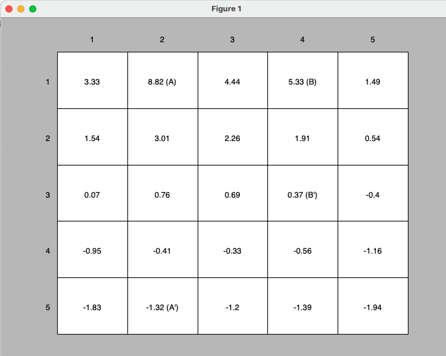

Code is here: [3_5_GridWorld_(simple_finite_MDP_Example_3_5).ipynb](3_5_GridWorld_(simple_finite_MDP_Example_3_5).ipynb)

## Example 3.8 GridWorld with optimal Policy and Value Function

Following exercise 3.5 to find optimal policy and Value function in a discrete space with four discrete equiprobables actions. The framework is the same seen before, but now, we use optimal Bellman equations

The optimal Value Function generated is showing below:

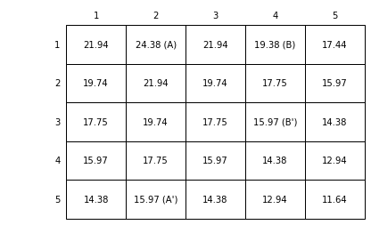

and optimal policy

Code is in: [3_8_GridWorld_(simple_finite_MDP_with_Bellma_optimality_equations_Example_3_8).ipynb](3_8_GridWorld_(simple_finite_MDP_with_Bellma_optimality_equations_Example_3_8).ipynb)

## Example 4.1 GridWorld Iterative Policy Evaluation (prediction)

Next example follows algorithm to find Optimal Policiy in a deterministic and discrete state and actions world. There are 4 equiprobables actions with no discount rate in the problem. Algorithm is shown below

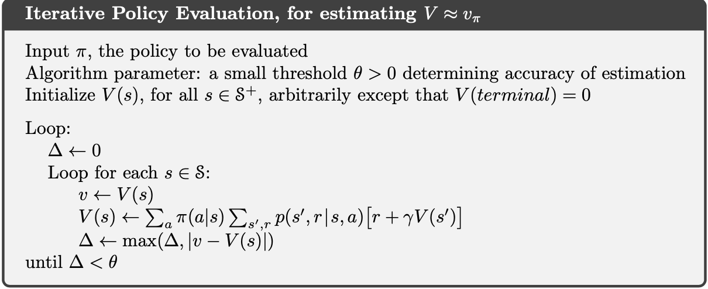

Result with best Value Function obtained:

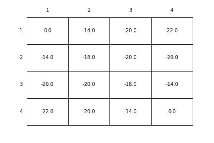

Code is in: [4_1_GridWorld_(optimal_policy_figure_4.1).ipynb](4_1_GridWorld_(optimal_policy_figure_4.1).ipynb)

## Example 5.4 off policy ordinary importance sampling

First off-policy algorithm in a simple world with a single state and two actions, one of then with different probability to be taken. 
Off-policy means we have to deal with 2 policies, Target policy which is the policy to be learned, and Behavior policy which generates behavior. 
As now we have 2 differents policies, we have to deal with different probability distributions, so importance sampling is the technique to estimating expected values under one distribution given samples form another. 
In this exercise, we work with ordinary importance sampling, where importance sampling is done as a simple average.

The algorithm is useful as a intro to off policy methods, and to understand their concepts.
In this case, the target policy and the behavior policy have to taken the same states at least one, being behavior policy more exploratory. 
The target policy becomes a deterministic optimal policy and the behavior remains stochastic, such as a greedy policy. 

Code is in: [5_4_off_policy_one_state_MDP.ipynb](5_4_off_policy_one_state_MDP.ipynb)

# Part Two: more complex algorithms, beginning with Temporal Differences (TD)

## Example 6.2 Temporal Differences (0) Random Walk

This is the first example of Temporal Difference algorithm. Such as algorithms have several important characteristics:
- no need models 
- off-policy or on-policy
- online interactions with envs
- bootstrap, means they get estimations over estimations, or guess from a guess.
- they depend only on next state to have info and rewards, unlike MC methods where they come into the end of the episode.

Code is in: [6_2_Random_walk(comparing_alphaMC_vs_TD(0).ipynb](6_2_Random_walk(comparing_alphaMC_vs_TD(0).ipynb))

## Example 6.5 Windy GridWorld SARSA

SARSA means State Action Reward State Action where we can try to learn the values of state action-pairs. The algorithm is show below
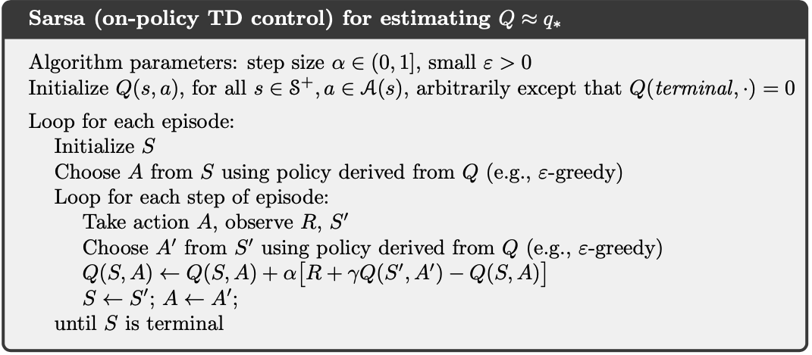

The main equation is in

>Q(S,A) = Q(S,A) + alfa (R + gammaQ(S',A') - Q(S,A)) 

Code is in: [6_5_windy_gridworld(e-Greedy_SARSA).ipynb](6_5_windy_gridworld(e-Greedy_SARSA).ipynb)

## Example 6.6 Cliff Walking GridWorld SARSA and Q-Learning

In this example, we introduce Q-Learning algorithm and compare with SARSA. Q_learning is off-policy, and it searchs optimal policy. Algorithm is shown below

.png)

The main equation is in

>Q(S,A) = Q(S,A) + alfa (R + gamm*amaxQ(S',A') - Q(S,A)) 

Code is in: [6_6_Cliff_walking(SARSA_vs_QLearning).ipynb](6_6_Cliff_walking(SARSA_vs_QLearning).ipynb)

## Example 6.6 Cliff Walking GridWorld SARSA, Q-Learning and expected SARSA

The same before example, cliff world, but now adding expected SARSA algorithm. This one, instead Q=learning, take the expected value using how likely each action is under the current policy.
The equation that rules the algorithm

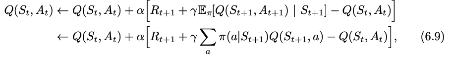

Code is in: [6_6_Cliff_walking(SARSA_vs_Qlearning_vs_Expected_SARSA).ipynb](6_6_Cliff_walking(SARSA_vs_Qlearning_vs_Expected_SARSA).ipynb)

## Example 8.1 Tabular Dyna-Q in a simple maze with obstacles

Is the first example with planning techniques, where the agent use a Model to planning the actions. The agent interacts direc with the experience taken from environment, and also save this experience in a Model to update policy and value funtion.

The cycle is shown below

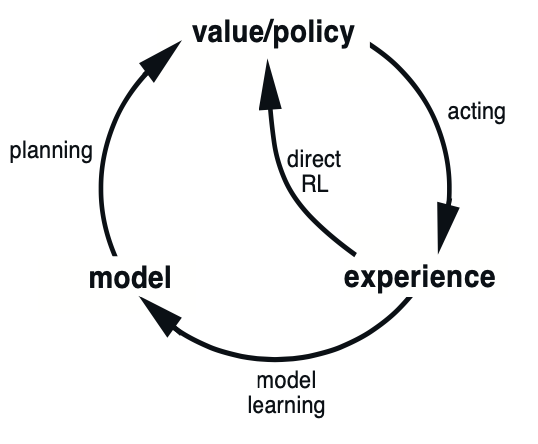

The algorithm is
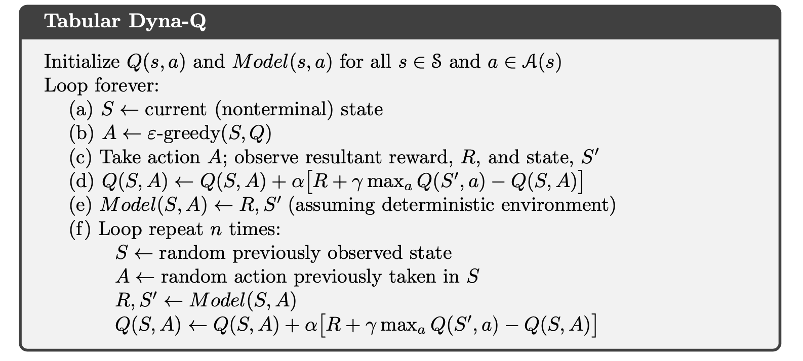

If we take only until (d) step, it is called a **direct RL** or **Q-learning** algorithm. And steps (e) and (f) it is the Tabular Dyna-Q with Model and Planning version.

Code is in: [8_1_Maze_(Tabular_Dyna-Q_planning_and_non_planning).ipynb](8_1_Maze_(Tabular_Dyna-Q_planning_and_non_planning).ipynb)

## Example 8.3 Dyna Q+ in a changing grid environment

Following Dyna techiques, thus new algorithm is designed to rule in a changing world. Imagine the obstacles are changing in a specific time, with Dyna Q, one the agent finds the optimal policy, never will try to explore new states or even old states. With Dyna Q+, always the agent explore in old states with a small temperature rate. 

Code is in: [8_3_DynaQ+_vs_DynaQ(dynamic_changing_obstacles_in_Maze).ipynb](8_3_DynaQ+_vs_DynaQ(dynamic_changing_obstacles_in_Maze).ipynb)

---
## Example 8.4 Prioritized Sweeping

The algorithm is shown below

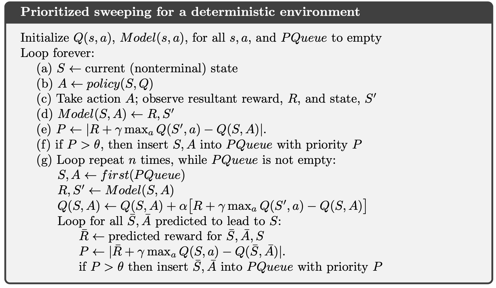

The idea behind this algorithm is that we can work only in states that have changed recently and update states closed to him, that is, backward focusing. We have a queu of states and theirs predecessors, so if one state is changed, all its predecessors too. Thus we only update a few states each time.

Code is in: [8_4_Prioritized_sweeping_vs_DynaQ.ipynb](8_4_Prioritized_sweeping_vs_DynaQ.ipynb)

---
## Policy Approximation 

### Example 13.1 Short corridor with switched actions.

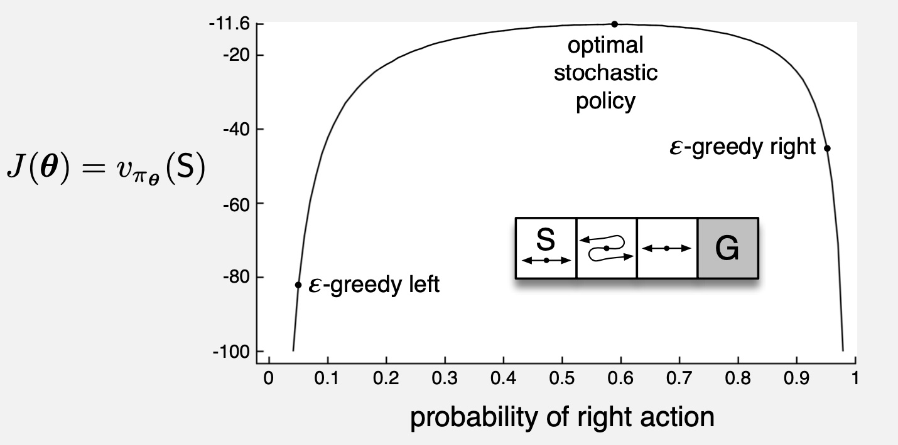

Code is in: [13_1_Short_corridor(Policy_approximation_with_e-greedy_selection).ipynb](13_1_Short_corridor(Policy_approximation_with_e-greedy_selection).ipynb)

---
## Example 13.2 REINFORCE Monte Carlo Policy Gradient

Generic algorithm can see below

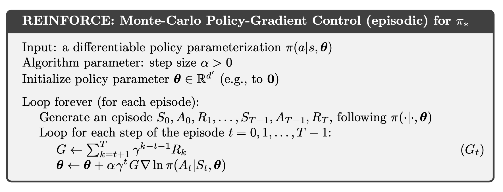

Code is in [13_2_Short_corridor(REINFORCE_MonteCarlo_Policy_Gradient_Control).ipynb](13_2_Short_corridor(REINFORCE_MonteCarlo_Policy_Gradient_Control).ipynb)

