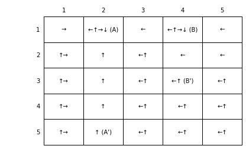

### Sources - 

### Table of contents

  - [Example 3.5 GridWorld](#3-5-GRID)
  - [Example 3.8 GridWorld with optimal Policy and Value Function](#3-8-GRID)
  - [Example 4.1 GridWorld Iterative Policy Evaluation (prediction)](#4-1-iteration-policy)

  - [Tabular Dyna-Q](#TABULAR-DYNA-Q)
  - [Dyna-Q +](#Dyna-Q-+)
  - [Prioritized Sweeping](#Prioritized-Sweeping)
  - [Policy Approximation](#Policy-approximation)
  - [REINFORCE Monte Carlo Policy Gradient](#REINFORCE-MC)
---

Ideas and code taking from: [2016-2018 Shangtong Zhang(zhangshangtong.cpp@gmail.com) and 2016 Kenta Shimada(hyperkentakun@gmail.com)](https://github.com/LyWangPX/Reinforcement-Learning-2nd-Edition-by-Sutton-Exercise-Solutions)
 

First implementation of a RL algoritmhs. It is a typical and beginner example for understanding basics ideas and concepts of RL.

We are going to follow the TextBook [Sutton]

## Example 3.5 GridWorld

Finite episodic MDP (Markov Decision Processes) with a grid of 5x5 states, and 4 equiprobables actions : left, right, up, down. Every action gives us 0 reward, except in those states which actions move the agent out, which results in -1, or in A state with reward +10, and B state, with reward +5. Discount rate of 0.9

The final Value Function generated is showing below:

Code is here: [3_5_GridWorld_(simple_finite_MDP_Example_3_5).ipynb](3_5_GridWorld_(simple_finite_MDP_Example_3_5).ipynb)

## Example 3.8 GridWorld with optimal Policy and Value Function

Following exercise 3.5 to find optimal policy and Value function in a discrete space with four discrete equiprobables actions. The framework is the same seen before, but now, we use optimal Bellman equations

The optimal Value Function generated is showing below:

and optimal policy

Code is in: [3_8_GridWorld_(simple_finite_MDP_with_Bellma_optimality_equations_Example_3_8).ipynb](3_8_GridWorld_(simple_finite_MDP_with_Bellma_optimality_equations_Example_3_8).ipynb)

## Example 4.1 GridWorld Iterative Policy Evaluation (prediction)

Next example follows algorithm to find Optimal Policiy in a deterministic and discrete state and actions world. There are 4 equiprobables actions with no discount rate in the problem. Algorithm is shown below

Result with best Value Function obtained:

Code is in: [4_1_GridWorld_(optimal policy figure 4.1).ipynb](4_1_GridWorld_(optimal policy figure 4.1).ipynb)

## (UNDER CONSTRUCTION)
## Tabular Dyna-Q

The algorithm is

Model and Planning verion that it is called Tabular Dyna-Q. 

If we take only until (d) step, it is called a **direct RL** or **Q-learning** algorithm. And steps (e) and (f) it is the Tabular Dyna-Q with Model and Planning version, which represents next figure

- Tabular_Dyna-Q V2.ipynb and Tabular_Dyna-Q V2.py contains implementation of TABULAR DYNA-Q. 
Running the code, we obtain figures representing policies and values for a given value. They are examples of a given value.

---
## Dyna-Q +

The Dyna-Q+ agent that did solve the shortcut maze uses one such heuristic. This agent keeps track for each state–action pair of how many time steps have elapsed since the pair was last tried in a real interaction with the environment. The more time that has elapsed, the greater (we might presume) the chance that the dynamics of this pair has changed and that the model of it is incorrect. To encourage behavior that tests long-untried actions, a special “bonus reward” is given on simulated experiences involving these actions.

One possible example of a grid changing world is showed in next image

The algorithm is in "DynaQ+ V1.py" and .pynb

---
## Prioritized Sweeping

The algorithm is shown below

The idea behind this algorithm is that we can work only in states that have changed recently and update states closed to him, that is, backward focusing. We have a queu of states and theirs predecessors, so if one state is changed, all its predecessors too. Thus we only update a few states each time.

The algorithm is in "prioritized sweeping V1.py" file

---
## Policy Approximation 

1. Short corridor with switched actions.

Algorithm can find in "short_corridor(chapter_13_policy_approximation).py"

---
## REINFORCE Monte Carlo Policy Gradient

Generic algorithm can see below

and code in "short_corridor(chapter_13_REINFORCE_MonteCarlo_Policy_Gradient_Control).py"

