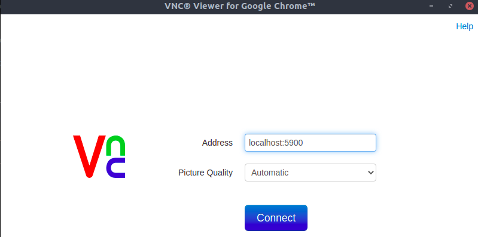
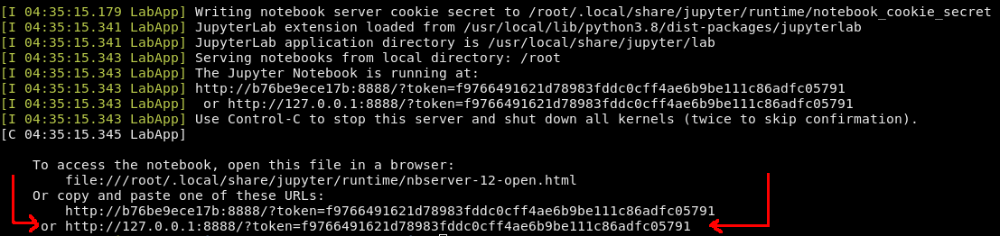
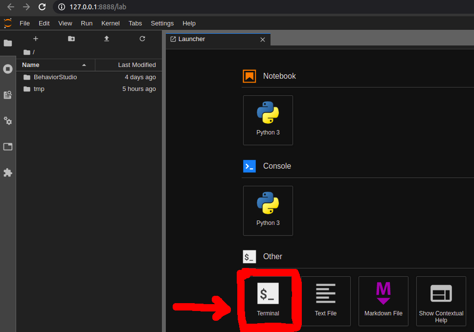
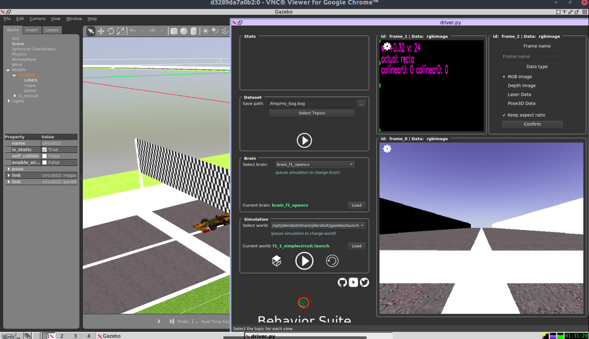

# Mac Users: MacOS Catalina V.10.15.7


## 1. Install any Python Version. Follow this [good tutorial](https://python-guide-es.readthedocs.io/es/latest/starting/install3/osx.html) 

Best way is with `brew`. To install it, in Terminal:
>`$ ruby -e "$(curl -fsSL https://raw.githubusercontent.com/Homebrew/install/master/install)"`

Next, we can install Python last version:
>`$ brew install python3` (I'm working with version 3.9.0)

or 
>`brew install python@3.8` to install version [you want](https://formulae.brew.sh/formula/python@3.8)

Now, we have installed python 2.7 and python 3.9.0
If you want launch version 2.7:
>`$ python`

If you want launch version 3.9.0:
>`$ python3`


Another import command to know and manage is `pip`
To upgrade or downgrade:
>`$ python -m pip install pip==19.2` 
where 19.2 is the version you have install
---
## 2. Virtual envs

Best way to work with Python projects, it is through virtual environments. You can make any number of them, which in you can load differents versions of any library including python versions.
It is the effective and accurately way to do it, because news and continuos versions.

2.1 Installing `pip` command

First of all, find out if there is pip command installed:
>` $pip --version`

Otherwise, follow this [link](https://pip.pypa.io/en/stable/installing/)

---
2.1 **Pipenv**

It is a high level command, similar npm. Allow manage dependencies between libraries. 

[Here](https://python-guide-es.readthedocs.io/es/latest/dev/virtualenvs.html#virtualenvironments-ref) you can find beginner guide to use pipenv. I don't use anymore.

---
2.2 **virtualenv**
We follow in the same [tutorial](https://python-guide-es.readthedocs.io/es/latest/dev/virtualenvs.html#virtualenvironments-ref)

virtualenv is a tool to create isolated Python environments. virtualenv creates a folder which contains all the necessary executables to use the packages that a Python project would need.

It can be used standalone, in place of Pipenv.

BE AWARE: install virtualenv could be difficult. Reasons are in Mac default Python version installed in O.S. is 2.7 which is deprecated. If you work with newer versions, you have to install virtualenv carefully with accesses to .zashrc. It seems one of the problems I had, was when virtualenv is exec, try to search in Python2.7 dirs, so if you have not well configured, always will appear any issues.

I've tried in [here](https://stackoverflow.com/questions/31133050/virtualenv-command-not-found) and [here](https://stackoverflow.com/questions/60416277/how-do-i-fix-this-error-distributionnotfound-the-zipp-0-5-distribution-was) and [here](https://stackoverflow.com/questions/21070369/importerror-no-module-named-virtualenv)


Install virtualenv via pip:

>`$ pip install virtualenv`

and test your installation:

>`$ virtualenv --version`. I have next message:

`$ virtualenv 20.2.1 from /usr/local/lib/python3.7/site-packages/virtualenv/__init__.py`

To create a virtual environment in the current directory:
>`$ virtualenv <env name>`

It creates a env with Python version you have by default. If you want to choose other version (which is highly recommended in many cases) you can write (like Python 2.7):

>`$ virtualenv -p /usr/bin/python2.7 <env name>` or

>`virtualenv -p /usr/local/opt/python@3.7/bin/python3.7 gym3.7` 
where you have to write your dir and name. Also it works another path where python version it's installed.

> `$ virtualenv -p /usr/local/bin/python3 gym3.8`

To activate env:

>`$ source <env name>/bin/activate`

And to deactivate:

>`$ deactivate`

An finally, to delete:

>`$ rm -rf <env name>`

After a while, though, you might end up with a lot of virtual environments littered across your system, and its possible you’ll forget their names or where they were placed.

Running 
>`$ virtualenv --no-site-packages`

 will not include the packages that are installed globally. This can be useful for keeping the package list clean in case it needs to be accessed later. 


 Creating **requirements.txt** file:

 In order to keep your environment consistent, it’s a good idea to “freeze” the current state of the environment packages. To do this, run

 >`$ pip freeze > requirements.txt`

This will create a requirements.txt file, which contains a simple list of all the packages in the current environment, and their respective versions. You can see the list of installed packages without the requirements format using “pip list”. Later it will be easier for a different developer (or you, if you need to re-create the environment) to install the same packages using the same versions:

>`$ pip install -r requirements.txt`

This can help ensure consistency across installations, across deployments, and across developers.

Lastly, remember **to exclude the virtual environment** folder from source control by adding it to the ignore list.


2.3. **virtualenvwrapper** (Note: system automatically installed Python 3.9 when brew was updated. Since then, there is a problem with a library. I never used it, so I let run away)

virtualenvwrapper provides a set of commands which makes working with virtual environments much more pleasant. It also places all your virtual environments in one place.

To install (make sure virtualenv is already installed):

>`$ pip install virtualenvwrapper`

>`$ export WORKON_HOME=~/Envs`

>`$ source /usr/local/bin/virtualenvwrapper.sh`

Create a virtual env in ~/Envs folder:
>`$ mkvirtualenv <env name>`

Work on a virtual env:
>`$ workon <env name>`

Deactivating is still the same:
>`$ deactivate`

To delete:

>`$ rmvirtualenv venv`

Others usufull commands 

List all of the environments.
>`$ lsvirtualenv`


Navigate into the directory of the currently activated virtual environment, so you can browse its site-packages, for example.
>`$ cdvirtualenv`

Like the above, but directly into site-packages directory.
>`$ cdsitepackages`

Shows contents of site-packages directory.
>`$ lssitepackages`

---
2.3. Last one to create envs: **venv** command

We follow [this official tutorial](https://docs.python.org/3/tutorial/venv.html)

To create a virtual environment, decide upon a directory where you want to place it, and run the venv module as a script with the directory path:

>`$ python3 -m venv <env name>`

and, to activate

>`$ source <env name>/bin/activate`

---
2.4 [**pip**](https://docs.python.org/3/installing/index.html#installing-index) command.


---
2.5 Inside virtual env

The standard packaging tools are all designed to be used from the command line.

The following command will install the latest version of a module and its dependencies from the Python Packaging Index:

>`$ python -m pip install SomePackage`

>`$ python -m pip install SomePackage==1.0.4    # specific version`

>`$ python -m pip install "SomePackage>=1.0.4"  # minimum version`

and:

>`$ python -m pip install --upgrade SomePackage`

The best way to work with envs is through requirements.txt file


---
# Ubuntu 20.04

It comes with Python 3.8.5

1. Install differents Python versions is very convenient for working with differents environments

- install pip
>`$ sudo apt install -y python3-pip`

- install python 3.7.9 version

```
$ sudo apt update
$ sudo apt install software-properties-common
$ sudo add-apt-repository ppa:deadsnakes/ppa
$ sudo apt-get update
$ sudo apt-get install python3.7
```

and install Python3.9.1

```
$ sudo apt update
$ sudo apt install software-properties-common
$ sudo add-apt-repository ppa:deadsnakes/ppa
$ sudo apt-get update
$ sudo apt-get install python3.9
```


2. We have several Python versions, and we will work with all of them (maybe), so we need install differents environments.


---
# Install [BehaviorStudio](https://jderobot.github.io/BehaviorStudio/install/ros_noetic)

Settings in:
Virtual Machine running Ubuntu 20.04
ROS Noetic
Gazebo 11.0

## Installing in a traditional way

1. Install Python 3.7

```

$ sudo apt install software-properties-common python3-pip python3-virtualenv

$ sudo add-apt-repository ppa:deadsnakes/ppa

$ sudo apt install python3.7

$ virtualenv -p python3.7 .behavior-studio

$ source .behavior-studio/bin/activate

$ pip install empy

$ sudo apt-get install python3.7-dev

```


2. Install ROS Noetics. Follow offical installation [here](http://wiki.ros.org/noetic/Installation/Ubuntu) and you shouldn't have any problems.


3. Installing dependencies

JdeRobot's Assets

```
$ sudo apt-get install ros-noetic-jderobot-assets

$ git clone https://github.com/JdeRobot/assets

$ pip install catkin_pkg

$ cd assets/jderobot_assets && mkdir build && cd build

$ cmake .. && sudo make && sudo make install

$ echo "source /opt/jderobot/share/jderobot/gazebo/assets-setup.sh" >> ~/.bashrc

$ source ~/.bashrc
```

JdeRobot’s CustomRobots

```
$ git clone -b noetic-devel https://github.com/JdeRobot/CustomRobots

$ cd CustomRobots/f1 && mkdir build && cd build

$ /bin/bash -c "source /opt/ros/noetic/setup.bash;

$ cmake .. && make && make install;"

```

ROS additional package

```
$ git clone https://github.com/strasdat/Sophus

$ cd Sophus && mkdir build && cd build

$ cmake ../ && make && make install

```

Gym-gazebo and Behavior Studio

```
$ sudo apt-get install libbluetooth-dev libcwiid-dev libftdi-dev libspnav-dev libsdl-dev libsdl-image1.2-dev libusb-dev ros-noetic-octomap-msgs ros-noetic-geodesy ros-noetic-octomap-ros ros-noetic-control-toolbox ros-noetic-pluginlib	ros-noetic-trajectory-msgs ros-noetic-control-msgs ros-noetic-std-srvs ros-noetic-nodelet ros-noetic-urdf ros-noetic-rviz ros-noetic-kdl-conversions ros-noetic-eigen-conversions ros-noetic-tf2-sensor-msgs ros-noetic-pcl-ros ros-noetic-navigation

$ git clone https://github.com/JdeRobot/BehaviorStudio

$ cd BehaviorStudio

$ git checkout noetic-devel

$ pip install -r requirements.txt

$ cd BehaviorStudio/gym-gazebo/

$ pip3 install -e .
```

If you are going to use the GUI you need to create the resources file for the application:

```
$ pyrcc5 -o behavior_studio/ui/gui/resources/resources.py \
	behavior_studio/ui/gui/resources/resources.qrc
```


Reinforcement Learning

To use current reinforcement brain first some variables must be loaded to the environment:

```
$ cd BehaviorStudio/gym-gazebo/

$ bash load_env.sh 
```


## Installing with Docker

1. Install [Docker](https://docs.docker.com/get-docker/) for [Ubuntu](https://docs.docker.com/engine/install/ubuntu/)


2. Running Behavior Studio Containers

For CPU:
```
$ docker run -dit --name behavior-studio-noetic \
	-p 5900:5900 \
	-p 8888:8888 \
	jderobot/behavior-studio:noetic
```

For GPU: I have not tried, but you hace detailed instructions [here](https://jderobot.github.io/BehaviorStudio/install/ros_noetic)

3. Using VNC to visualize container

To connect to our container [VNC viewer](https://chrome.google.com/webstore/detail/vnc%C2%AE-viewer-for-google-ch/iabmpiboiopbgfabjmgeedhcmjenhbla?hl=en) for chrome (recommended) or [RealVNC](https://www.realvnc.com/en/) can be installed to access the GUI through the port 5900.



You will need to authenticate, the current password is **jderobot**, although it can be changed in the script vnc_startup.sh


4. Using terminal in container

The recommended way to work, is by writing down docker logs container-name and you will get an URL, which will take you to notebook, double click on the last URL to open Jupyter.




Go to that URL in the browser (outside VNC) and once you are in the notebook you can open up a terminal by clicking in Terminal.




Then type:

> `$ bash`

and this window will behave as any other Ubuntu terminal, so you are ready to run Behavior Studio, and once the GUI is opened it will be displayed in the VNC window.

```
cd BehaviorStudio/behavior_studio

python3 driver.py -c default.yml -g
```




That' all!!

5. If something fails. I had a problem with last command. It appeared me a issue message indicating Gazebo server wasn't launched, such as

```
Unable to register with master node [http://localhost:11311/]: master may not be running yet. Will keep trying.
```


To fix it, 

>`$ sudo apt-get update && sudo apt-get upgrade`

and launching roscore

>`$ roscore`

and Fix it!!!

6. Aditional commands

- Stopping container. behavior-studio-noetic should be replaced with the name of your container.

>`$ docker stop behavior-studio-noetic`

- Resuming container
behavior-studio-noetic should be replace with the name of your container, this command is similar to docker run so now you can run docker logs container_name to get a new link for jupyter, and then connect as usual to your VNC viewer.

>`$ docker restart behavior-studio-noetic`

- Building the latest container
First go to the folder where the Dockerfile is, then use docker use docker built command with the desired name tag.

```
$ cd BehaviorStudio/.docker/noetic/
$ docker build -t any-tag-you-want .
```


# Open AI

1. Getting Started in [OpenAI web](https://gym.openai.com/docs/) and [Github](https://github.com/openai/gym)

2. Create virtual environment with **virtualenv** 
`$ virtualenv gym` in $PHD. Using Python 3.7. According with OpenAI we have to use >3.5 version


(Important note: OpenAI first script command install **ffmpeg** library to visualize output video frames. So, updating env thought `brew install ffmpeg` has updated python version to 3.9)

3. Install gym library 
>`pip install gym`

4. It is convenient cloning gym repo to modify and built new models:
```
$ git clone https://github.com/openai/gym
$ cd gym
$ pip install -e .
```

5. Test installation. Create new python file **cartPole-v0_PedroV0.py**
and copy next code.
```
import gym
env = gym.make('CartPole-v0')
env.reset()
for _ in range(1000):
    env.render()
    env.step(env.action_space.sample()) # take a random action
env.close()
```

Run file:
>`python cartPole-v0_PedroV0.py`

and it works!!!


---
# Working with OpenAI Gym

## Setup the environment

1. Creating HOME environment variable in .zshrc

>`$ export PHD=$HOME/PhD/PhD_working`

2. Creating new virtual env. In $PHD:
>`$ virtualenv gym`
This env will be where install all libraries and dependencies in

3. Activating always the gym env
>`$ source gym/bin/activate`

4. Follow this [tutorial](https://gym.openai.com/docs/) and cloning gym Github:

```
git clone https://github.com/openai/gym
cd gym
pip install -e .
```


