# MountainCar-v0 (OpenAI) 

## Q Learning algorithm

En este ejercicio vamos a trabajar el entorno MountainCar-V0 de OpenAi con el algoritmo Qlearning.

El entorno de trabajo se ha realizado con las siguientes características mas relevantes 
Mac Big Sur 11.3
python 3.8.6
gym 0.18.0
El resto de librerías se encuentran en el fichero requeriments.txt

El código se encuentra en el fichero QLearning_multiple.py

El entorno de OpenAI (https://gym.openai.com/envs/MountainCar-v0/) muestra un auto posicionado al inicio en un valle y tiene que alcanzar la meta que se encuentra en la parte derecha de una colina. 
El espacio de acciones es discreto, con solo 3 acciones, 0 acelerar izquierda, 2 acelerar derecha y 1 no acelerar.
El espacio de estados es discreto también con solo 2 estados, 0 representa la posición con rangos min y max [-1.2 ,  +0.6] y 1 representa la velocidad con rangos min y max [-0.07 , +0.07]. Si bien, solo hay 2 estados, los valores que contienen son continuos por lo que podremos considerar que es un entorno mixto continuo-discreto. 
Las características del entorno desarrollado las encontramos aquí: https://github.com/openai/gym/blob/master/gym/envs/classic_control/mountain_car.py

El algoritmo QLearning es un método tabular que guarda los valores Q(s,a) en una tabla, por lo que debemos discretizar todos los valores que puede tomar el entorno.
Recordando la ecuación de Qlearning

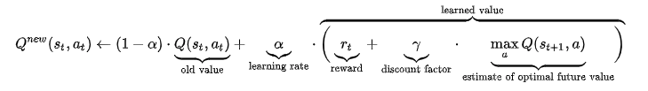

Otra forma de ver la ecuación está en 6.8 del libro de Sutton:

A continuación analizaremos los diferentes hiperparámetros del algoritmo para ver como se comportan los resultados

### Hiperparámetros

•	Tamano de la tabla

En el caso de los estados, vamos a analizar los resultados del algoritmo con tablas de diferentes tamaños, 20x20, 40x40, 80x80 para analizar el comportamiento del algoritmo en función del tamaño de los rangos que separamos los valores continuos. Es decir, en una tabla de 20x20, crearemos 20 rangos que separaran los valores de [-1.2 , +0.6] de manera proporcional para la variable posición y [-0.07 , +0.07] para la variable velocidad.
De esta manera discretizamos el espacio de estados.

•	Episodios, trabajaremos con valores desde 5.000 hasta 25.000 

•	Epsilon [1, 0] o variable que sirve para controlar la exploración frente a la explotación del algoritmo, analizaremos valores desde 1 hasta 0.1 y analizaremos los resultados. Cuando el valor esta cercano a 1, al algoritmo explora continuamente y tarda mucho en converger a buenos resultados. Iremos viendo como se comporta nuestro algoritmo.

•	Tasa de decaimiento de épsilon. Ajustaremos el valor para analizar si afecta a nuestros resultados

•	Tasa de aprendizaje (learning rate) según la ecuación 2.4 del libro de referencia [Sutton] es la variable StepSize que reduce la diferencia entre el valor objetivo y el valor estimado. El valor se encuentra entre (0,1] y si esta muy cercano a 1 entonces 1 – alfa = 0 por lo que  dara todo el peso a la ultima recompensa. Cuanto alfa este mas cercano a 0 y la ecuación 1-alfa Aprx a 1, otorgara mas peso a las recompensas pasadas. En nuestro algoritmo lo vamos a dejar constante en cada ejecución aunque haremos ejecuciones con diferentes valores. Una posible mejora es aplicar decaimiento según se van ejecutando episodios dentro de la misma ejecución.

•	Tasa de descuento (discount rate) [1 - 0], o variable que indica la importancia de valores futuros. Analizaremos diferentes valores

Al ser un entorno con valores predeterminados por OpenAI, nos devuelve automáticamente los valores de

•	El entorno también nos proporciona el estado inicial del carro en cada episodio, siempre en la posición entre [-0.6 y -0.4]

•	Recompensas: cada movimiento que no alcanza el objetivo tiene una recompensa de -1 y 0 solo cuando alcanzamos el objetivo. Esto hace que la suma de recompensas, aun en el mejor de los casos, sea negativa.

Ms adelante, nuestra intención es trabajar con diferentes valores de recompensas para analizar los resultados.

•	Inicialización de la tabla Qlearning, en donde vamos a crearla de manera aleatoria con valores entre -2 y 0. Mas adelante analizaremos como la inicialización de la tabla Q puede hacer que el algoritmo se comporte mejor. Valores a 0 o positivos.

### Primer análisis

•	Episodios: 5000
•	Épsilon: 1
•	Épsilon_decay_value = epsilon / (episodios - 1)
•	Tamano de la tabla: 40x40x3 (3 son las acciones)
•	Learning_rate = 0.1
•	Discount_rate= 0.95
•	Q tabla inicializada aleatoriamente con valores entre -2 y 0

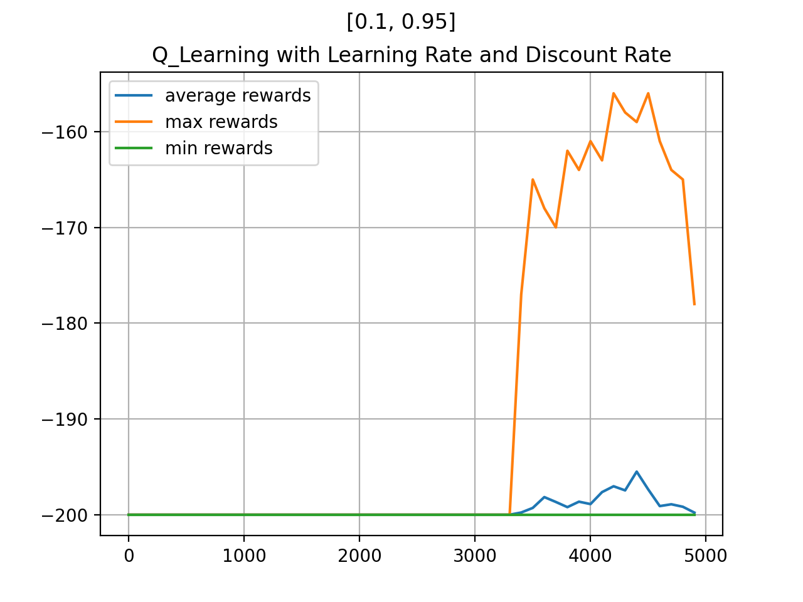
La ejecución de QLearning nos muestra que hasta el episodio 3400 aprox. El algoritmo no encuentra soluciones y se dedica a explorar (recordar que el entorno se inicializa si el carro encuentra el objetivo o han pasado 200 episodios sin alcanzarlo). Desde este episodio hasta el 4500 aprox el resultado se alcanza porque ha ido aprendiendo pero hay una caída al final que deberemos ir analizando. 

En la siguiente imagen vamos a ver como se ha distribuido las acciones en nuestra tabla Q para el episodio 4000.

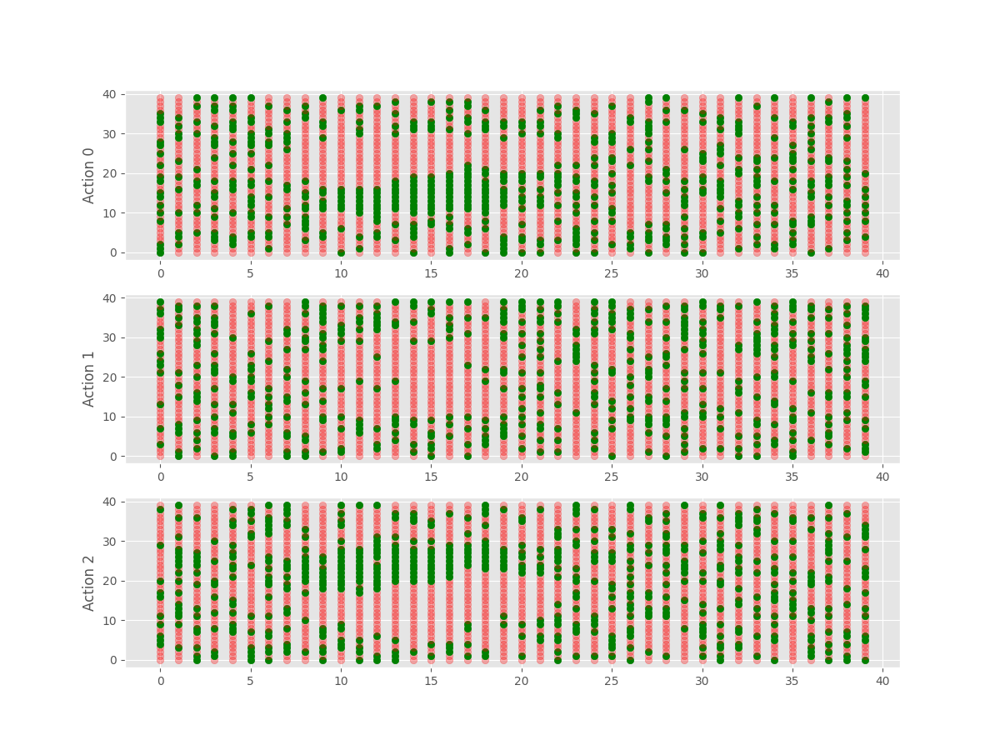

Recordemos que nuestra tabla Q que guarda nuestros valores, tiene un tamaño de 40 x 40. Cada celda representa el espacio de estados que lo hemos discretizado. Por lo tanto, la fila 40 del grafico muestra la posición mas cercana al objetivo (0.6) y la columna 40 representa la mayor velocidad tomada (0.07)

Las acciones son 

    0: acelerar a la izquierda
    1: no acelerar
    2: acelerar a la derecha

Los puntos de color verde representan el valor máximo de la tabla.

Podemos ver que hay un cluster de verdes en la acción 0, para las filas inferiores, desde la columna 10 hasta la 25 aproximadamente. Esto nos indica que son las posiciones alejadas a la meta en donde el carro esta acelerando al máximo para subir la colina de la izquierda y poder tomar fuerza para luego subir a la derecha y alcanzar la meta.
En la grafica de la acción 2 (acelerar a la derecha) el cluster encontrado es el inverso del anterior, en donde parece que el carro acelera a la derecha en las posiciones cercanas a la meta.

### Segundo análisis (25000 episodios)

Todas las variables son las mismas que en el primer análisis, pero vamos a ejecutar 25000 episodios para analizar el resultado.

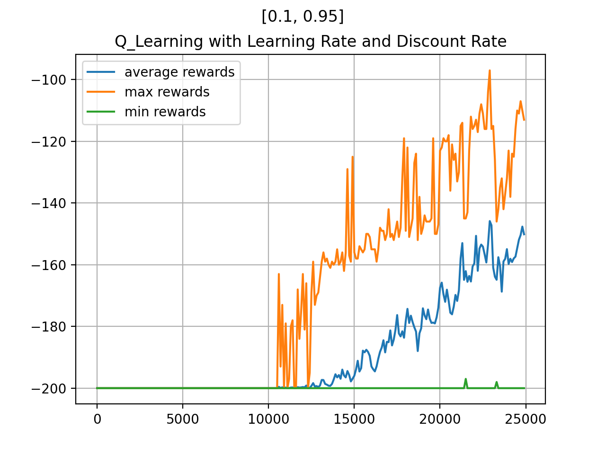

El algoritmo ha empezado a converger a partir de los 10000 episodios. Se ve una línea creciente de recompensas (o decreciente en el resultado) llegando a su optimo sobre los 23000 episodios.

Veamos la tabla Q en el episodio 23000 para analizar su resultado.

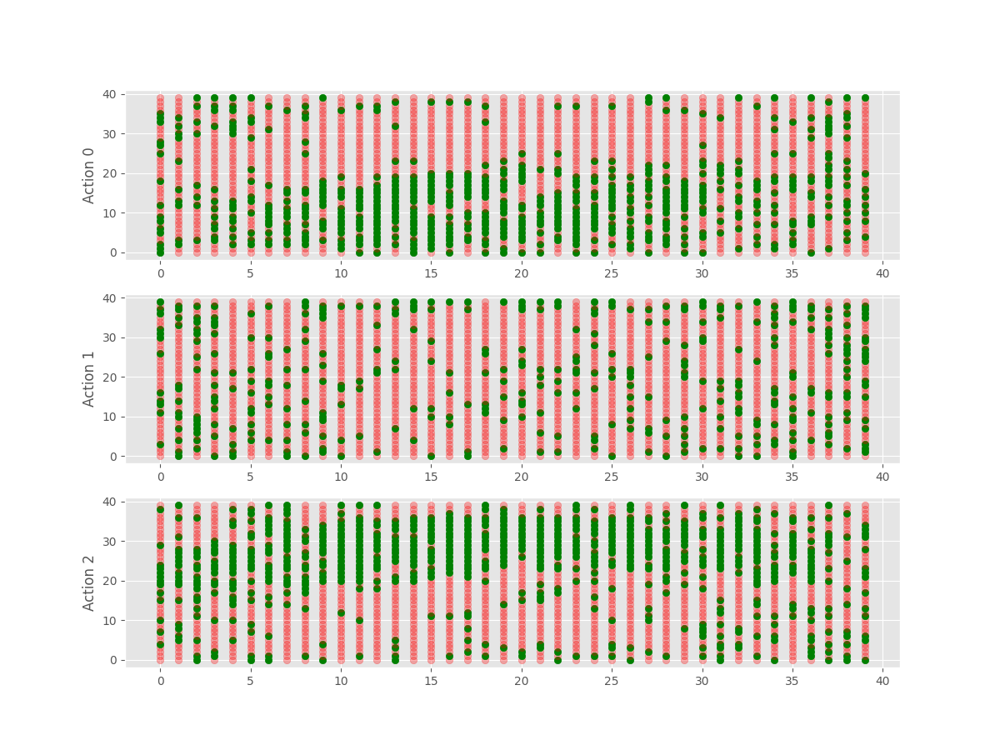

Recordemos que la acción 1 es no acelerar, es decir, dejar el carro suelto. La acción 0 acelerar a la izquierda y la 2 acelerar a la derecha. Se ve que en las posiciones cercanas al objetivo (filas 40 y adyacentes) la acción elegida ha sido acelerar a la derecha para acercarse al objetivo. Mientras que en las posiciones cercanas al extremo opuesto de la meta, se elige la acción 0, o acelerar a la izquierda para tomar impulso. La acción 1 se toma también cercana a la meta, en donde parece que el carro ya tiene mucho impulso para llegar. Esto puede ser debido a los episodios pasados en donde el carro se balanceaba de manera aleatoria y quedaba registrada en nuestra tabla Q

### Vamos a ejecutar varias pruebas con todos los valores similares a los anteriores ejercicios (tabla tamaño 40 x 40, 25000 episodios, épsilon decay similar) y cambiamos Learning rate y Discount rate

    Learning rate : 0.20 y Discount rate : 0.95

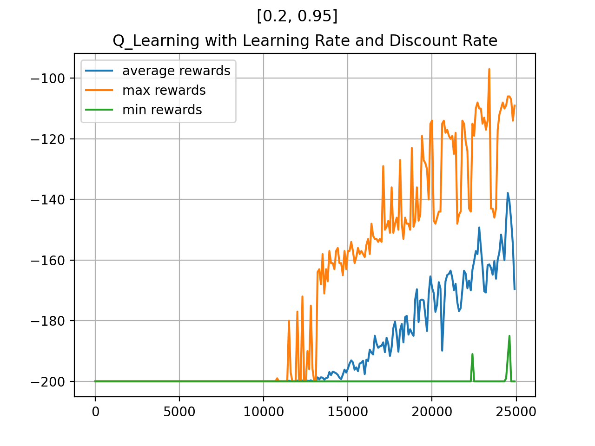

Recordemos que la tasa de aprendizaje (learning rate) si esta cercana a 0, esta dando mas importancia a los valores recientes. Por tanto cuanto mas incrementemos este valor, los valores máximos de cada acción crecerán mas lentamente. Posiblemente sea mas estable al algoritmo en su resultados….veamos

    Learning rate : 0.20 y Discount rate : 0.80

 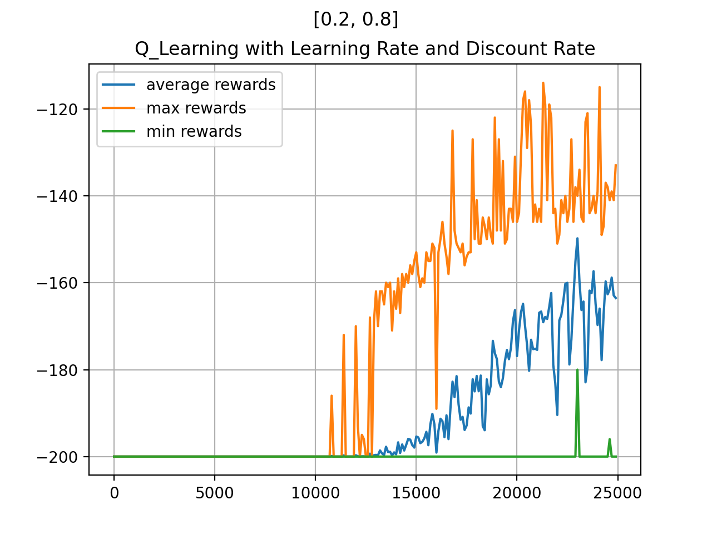   

 Si lo comparamos con la ejecución anterior (Learning rate : 0.2, Discount rate : 0.95) vemos que empieza a verse los primeros resultados a partir del episodio 10000 de manera similar, aunque parece que los resultados conseguidos no son tan buenos, mejor ejecución sobre los -110 puntos, frente a los -95 aprox de la anterior.
Dsicount rate de 0.80 indica que estamos dando mas importancia a los valores pasados según vamos decreciendo la variable.

    Learning rate : 0.20 y Discount rate : 0.50

 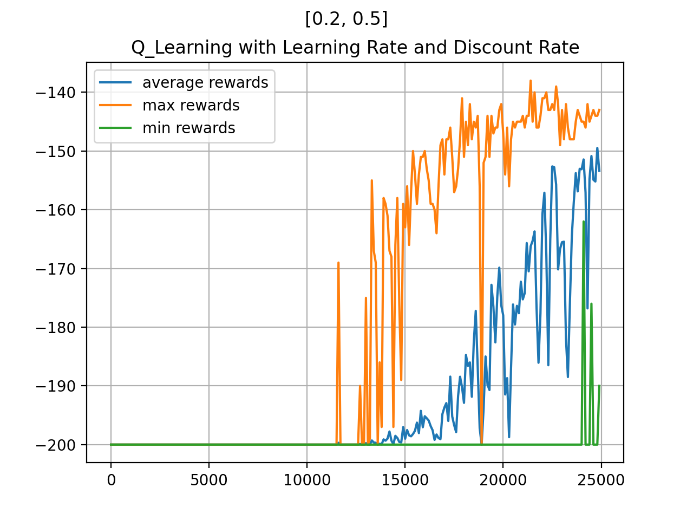   

 Obtenemos resultados peores en las recompensas

     Learning rate : 0.50 y Discount rate : 0.95

 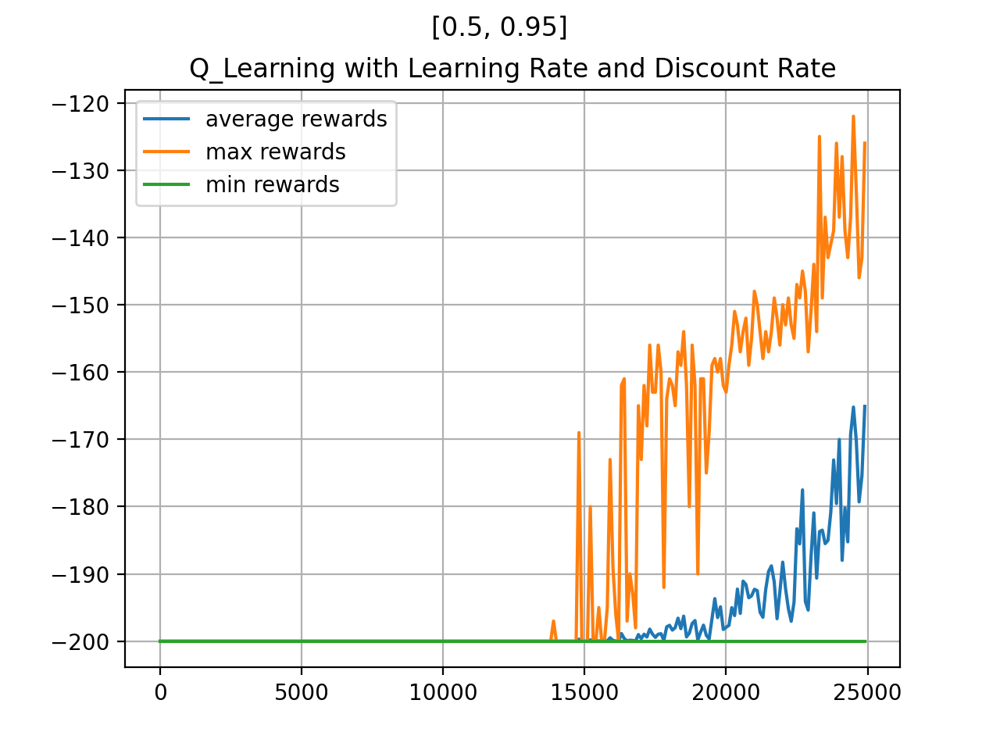  

      Learning rate : 0.50 y Discount rate : 0.80

   

      Learning rate : 0.50 y Discount rate : 0.50

 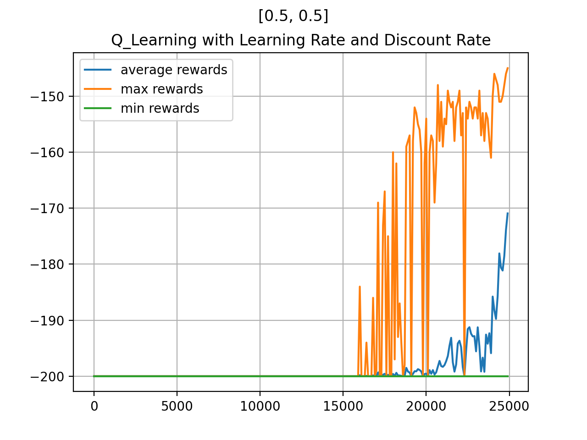  

      Learning rate : 1 y Discount rate : 0.95

 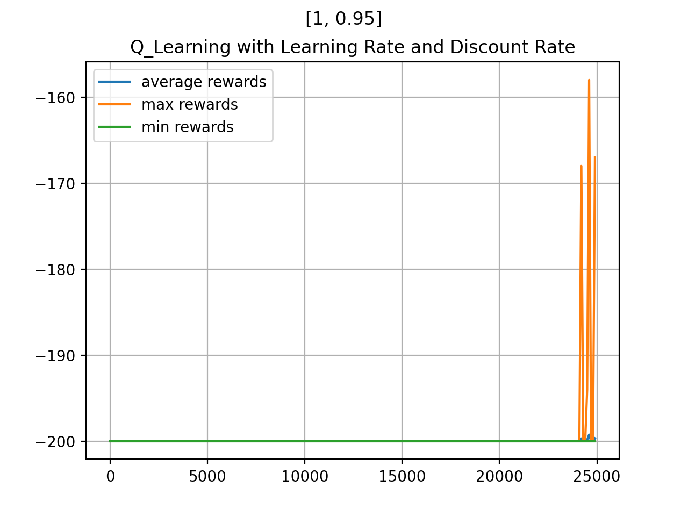  

      Learning rate : 1 y Discount rate : 0.5

 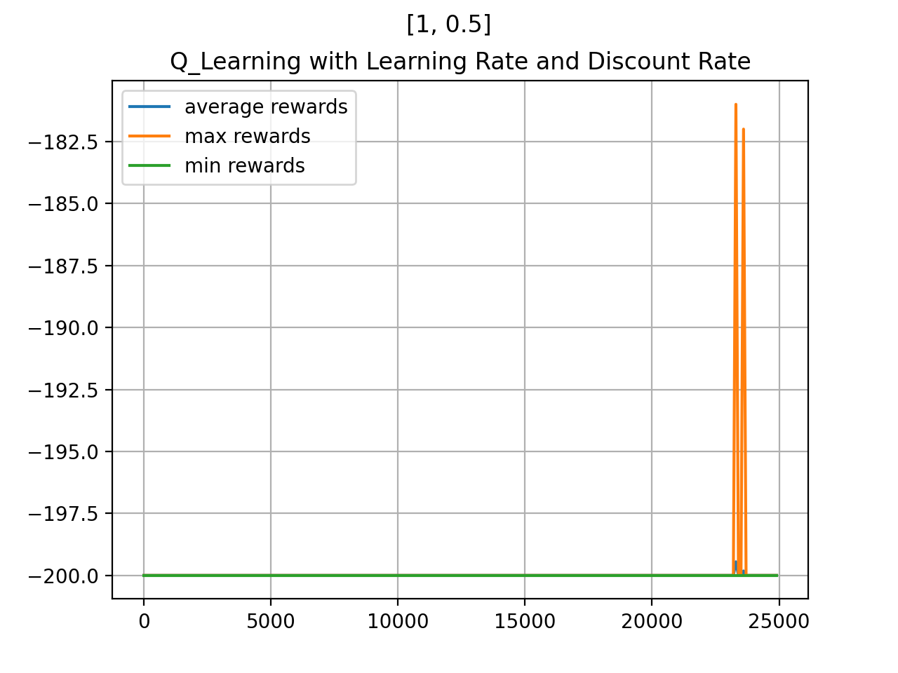  

 Segun hemos ido cambiando los parametros, los resultados han sido peores. 

 Veamos como afecta el tamano de la tabla. Hasta ahora hemos realizado pruebas con una tabla de tamano 40 x 40 x 3. Vamos a analizar con tablas de tamano 20 x 20 x 3 y 80 x 80 x 3

    Tabla 20 x 20 (learning rate = 0.1 y discount rate 0.95)
 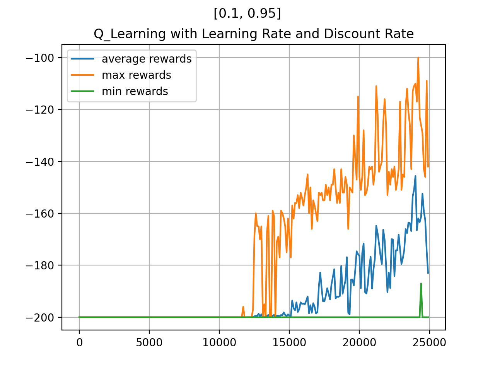    

    Tabla 80 x 80 (learning rate = 0.1 y discount rate 0.95)
 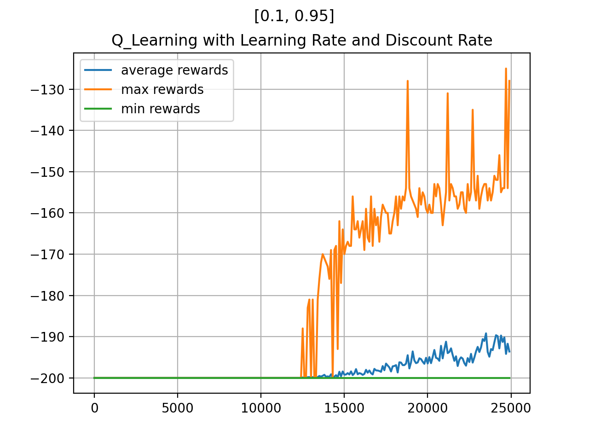    

 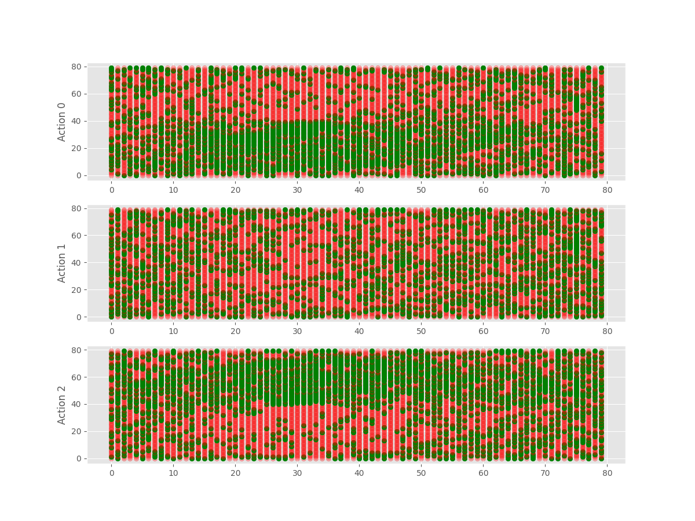

 Con una tabla de 80 x 80 celdas, vemos que en las filas cercanas a la 80 (posición cercana al objetivo), la acción mas elegida es la 2, acelerar a la derecha. En posiciones cercanas a la izquierda (entre las filas 0 y 30 aprox) la acción mas tomada es la 0 o impulso a la izquierda. Tiene sentido porque de esta manera el carro coge impulso para luego subir.

 ### Epsilon

 Hasta ahora, el hiperparametro épsilon tenia una tasa de decaimiento que venia con la formula

    epsilon / (episodios – 1)
Épsilon lo hemos definido =1, por lo tanto la tasa de decaimiento era de 0.00004

Epsilon nos sirve para controlar la exploración frente a la explotación de resultados. Cuando esta cercano a 1, el algoritmo explora por el espacio de estados y genera muchos valores aleatorios. Vamos a hacer que épsilon decaiga mas rápidamente.

    Tabla 40 x 40 (learning rate = 0.1 y discount rate 0.95), epsilon decay 0.00008 (doblamos frente al mejor resultado)

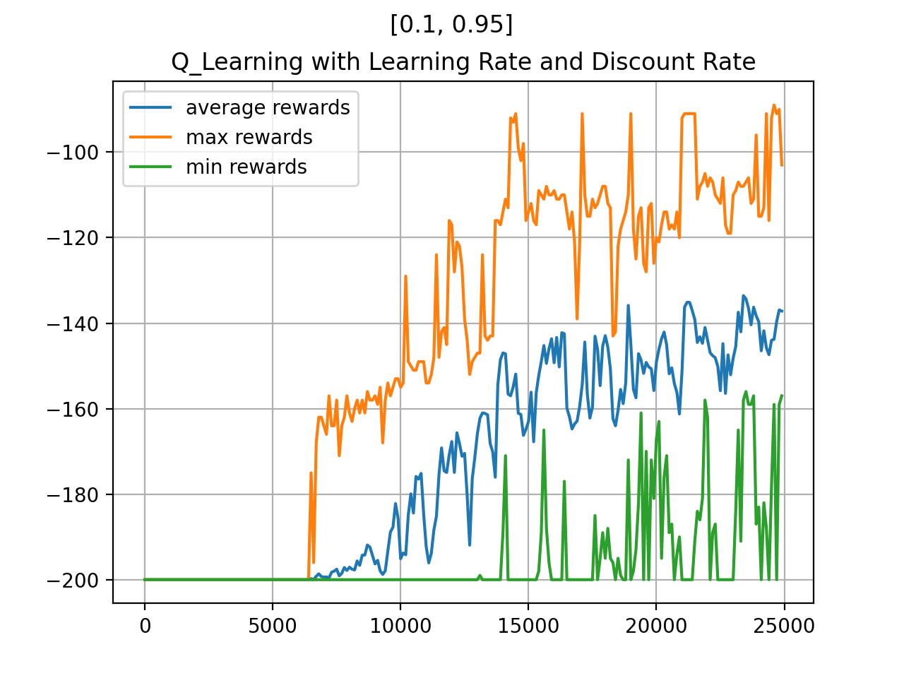      

Podemos observar la importancia de esta variable, que hace que nuestro algoritmo comience a encontrar resultados a partir del episodio 6000 aprox. frente a los mas de 10000 que necesitaba anteriormente
Asi mismo los resultados son mejores que antes, mejorando los rewards cerca de los 1500 episodios. 
Con épsilon estamos haciendo que el algoritmo comience antes a explotar los resultados que tenemos en la tabla Q

    Tabla 40 x 40 (learning rate = 0.1 y discount rate 0.95), epsilon decay 0.00016

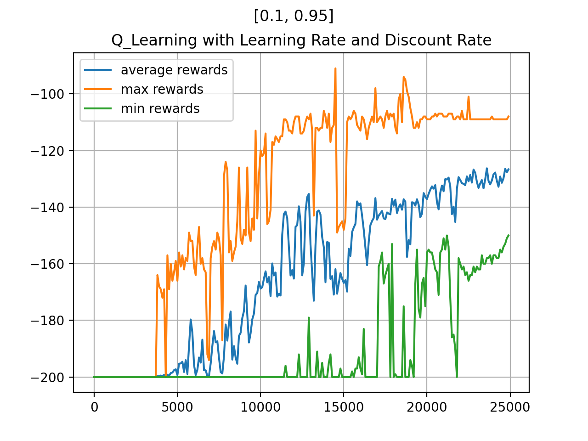     

    Tabla 40 x 40 (learning rate = 0.1 y discount rate 0.95), epsilon decay 0.004

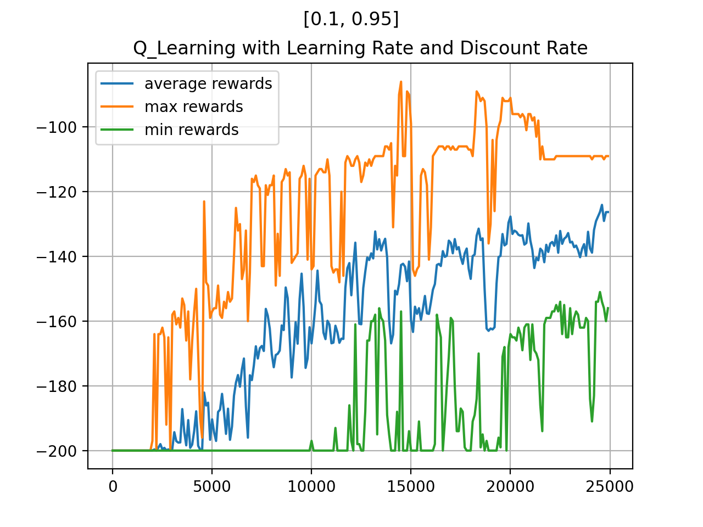    

### Conclusiones

En este algoritmo y para este entorno, hemos visto que la variable epsilon condiciona mucho los resultados, haciendo que el algoritmo converja rapidamente cuando la tasa de decaimiento es mayor.

