# Terms

- Agent: The learner and decision maker. Informally, the agent’s goal is to maximize the total amount of reward it receives. This means maximizing not immediate reward, but cumulative reward in the long run
- Environment: The thing it interacts with, comprising everything outside the agent. The general rule we follow is that anything that cannot be changed arbitrarily by the agent is considered to be outside of it and thus part of its environment

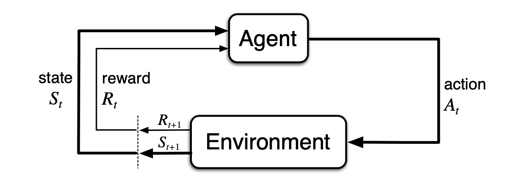 Diagram shown a typical MDP framework (discrete agent environment interaction)

---
- Policy: a mapping from situations to the actions that are best in those situations (pag 41 TextBook). Or in other way, is a mapping from states to probabilities of selecting each possible action (is a distribution over actions for each state). In general, a policy assigns probabilities to each action in each state. A policy depends only on the current states (not time or previous states). In other words, policies tell an agent how to behave.

- Optimal Policies: is one which as good as or better than every other policy. The value function for the optimal policy thus has the greatest value possible in every state.

- Policy evaluation is the task of determining the state function $v_\pi$ for policy $\pi$

- Control is the task of improving an existing policy.

- Deterministic policy: a policy maps each state to a single action.
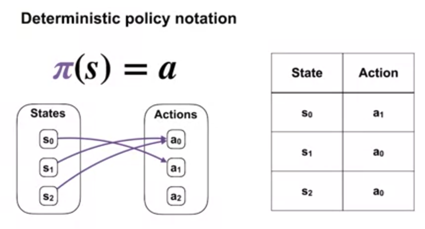

- Stocastic policy (Epsilon soft policy into on-policy methods): A stochastic policy is one where multiple actions may be selected with non-zero probability. Maps each state to a distribution over all possible actions.

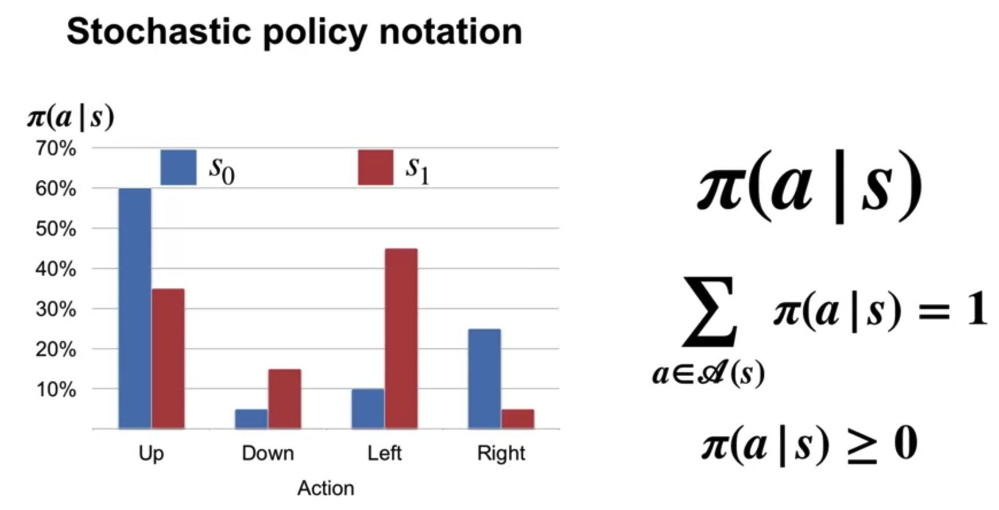

Next image shows two situations, one valid and other one invalid because depends past states

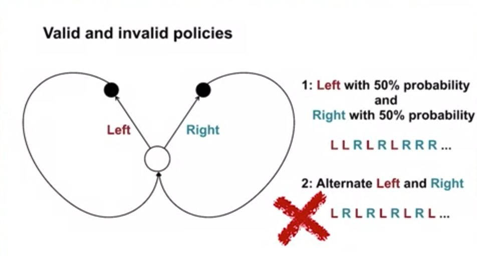

- On-policy methods and off-policy methods. On-policy methods attempt to evaluate or improve the policy that is used to make decisions, whereas off-policy methods evaluate or improve a policy diferent from that used to generate the data.
It's worth noting that off policy learning is a strict generalization of on policy learning.
On policy is the specific case where the target policy is equal to the behavior policy.

- off policy learning is another way to obtain continual exploration. The policy that we are learning is called the target policy and the policy that we are choosing actions from is the behavior policy. if we want to learn an optimal policy but still maintain exploration? The answer lies with off-policy learning.

Inside last one, 
- Target policy ($\pi(a|s)$) is the target of the agents learning. A target policy is the policy that the agent learns about in its value function.

- Behavior policy the policy that the agent is using to select actions. Is in charge of selecting actions for the agent. 

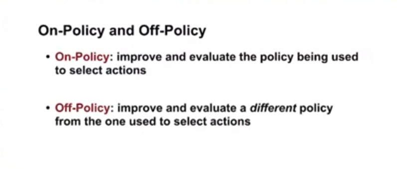

- Generalized Policy Iteration (point 4.6 textbook): Generalized policy iteration or GPI, combines two parts; policy evaluation and policy improvement. The first algorithm we saw with this form was policy iteration. Policy iteration runs policy evaluation to convergence before gratifying the policy.

---

- State: the states can be anything we can know that might be useful in making them. States provide all the actions need.

- State Value Function: a state value function is the future award an agent can expect to receive starting from a particular state. More precisely, the state value function is the expected return from a given state. Also it is called Bellman equation for State-Value
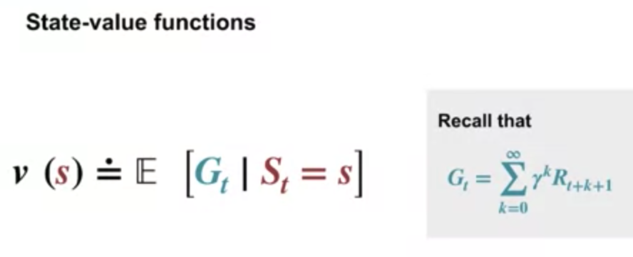
G stands for the expected discount rewards
The value function summarizes all the possible futures by averaging over returns. Ultimately, we care most about learning a good policy. Value function enable us to judge the quality of different policies

- Optimal state value Function

- value functions: functions of states (or of state–action pairs) that estimate how good it is for the agent to be in a given state (or how good it is to perform a given action in a given state). Estimates future return under a specific policy. There are 2 kinds of: **State Value Functions** and **Action Value Functions**. The value function estimates the expected future return for each stage or each state-action pair under a certain policy

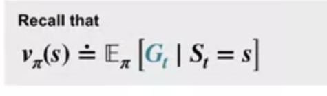

- Optimal Value Functions: given an optimal value function is easy to find an associated optimal policy.

- Action: in general, actions can be any decisions we want to learn how to make

- Reward: In reinforcement learning, the purpose or goal of the agent is formalized in terms of a special signal, called the reward, passing from the environment to the agent. At each time step, the reward is a simple number, $R_t \in R$

- Action-Value Function
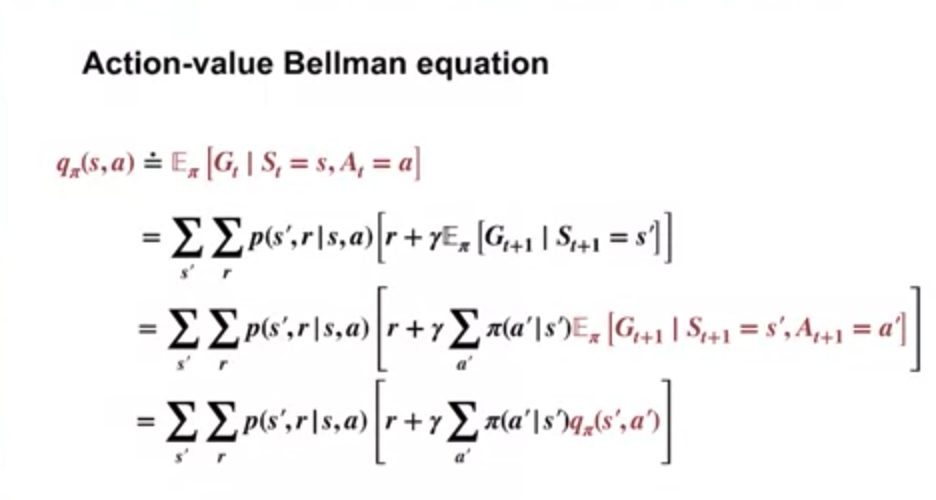

- Optimal Action Value Function

- episodes: the agent–environment interaction breaks naturally into subsequences.

- episodic tasks: the episodes can all be considered to end in the same terminal state, with different rewards for the different outcomes. Tasks with episodes of this kind are called. Episodes are independent. The return at time step t is the sum of rewards until termination.

- continuing tasks: there are no terminal states and interaction goes on continually. The total reward  is the sum of the rewards plus a discount factor.

- Bellman equations define a relationship between the value of a state or state-action pair and its successor states.

**Exploration vs. Exploitation Dilemma**:
when explore we get a more estimated of our values
when exploit we get more reward

q(a) = 0 is the estimated value for an action

N(a) = 0 is the number of times you made the action

$q_*(a) = 0$ is the value for each action

# Reference book

# Part I: Tabular Solution Methods
## Chapter 2 Multi-armed Bandits

- Action Value or Action Value Function: the value of taking each Action

The value then of an arbitrary action a, denoted $q_*(a)$, is the **expected reward** given that a is selected:
> $q_*(a) \doteq \mathbb{E}[ R_t | A_t = a]$ = $\displaystyle\sum_{r}p(r|a)r$ (probability of observig a reward given action a, times reward).We can switch to continuos situation just changing by $\int$

- Learning action Values

2.4 Incremental Implementation

> $Q_{n+1} = Q_n + \frac{1}{n}[R_n - Q_n]$         (2.3)

> NewEstimate $\leftarrow$ OldEstimate + StepSize [Target - OldEstimate] (2.4)

A simple bandit algorithm (page 32 reference book)

- Beginner way: **Epsilon greedy Action Selection** (for exploit vs. explore dilemma)

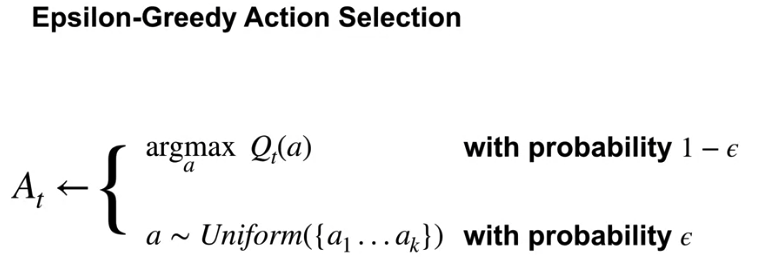

2.5 Tracking a Nonstationary Problem

> $Q_{n+1} = Q_n + \alpha[R_n - Q_n]$        where $\alpha \in (0,1]$ (2.5)

> $Q_{n+1} = (1-\alpha)^nQ_1 + \displaystyle\sum_{i=1}^{n}\alpha(1-\alpha)^{n-i}R_i$ (2.6)

2.6 Optimistical Initial Values

2.7 Upper-Confidence Bound Action Selection

-Action-Selection.png)

2.8 Gradient Bandit Algorithms

2.9 Associative Search (Contextual Bandits)

---
## Chapter 3 Finite Markov Decision Processes
In Markov Dynamic Processes the present state is suffient and remembering earlier state would not improve predictions about the future.

Next function p, defines the dynamics of the MDP:

> $p(s',r|s,a) \doteq Pr\{{S_t =s',R_t =r | S_{t-1} =s,A_{t-1} =a\}}$ (3.2)

From (3.2) we can calculate:

> $p(s'|s,a) \doteq Pr\{{S_t =s'| S_{t-1} =s,A_{t-1} =a\}} = \displaystyle\sum_{r\in R}{p(s',r|s,a)}$ (3.4)

We can also compute the expected rewards for state–action pairs as a two-argument function
> $r(s,a) \doteq \mathbb{E}[R_t|S_{t-1}=s,A_{t-1}=a]= \displaystyle\sum_{r\in R}r\displaystyle\sum_{s'\in S}{p(s',r|s,a)}$ (3.5)

and the expected rewards for state–action–next-state triples as a three-argument function
r:
> $r(s,a,s') \doteq \mathbb{E}[R_t|S_{t-1}=s,A_{t-1}=a, S_t=s']= \displaystyle\sum_{r\in R}r\frac{{p(s',r|s,a)}}{p(s'|s,a)}$ (3.6)

Future Rewards with expected discount:
> $G_t \doteq R_{t+1}+ \gamma R_{t+2}+ \gamma^2 R_{t+3}+ \dotso = \displaystyle\sum_{k=0}^{\infin}\gamma^k R_{t+k+1}$ (3.8)

and Returns at successive time steps are related to each other:
>$G_t \doteq R_{t+1}+ \gamma G_{t+1}$

For example, if reward is constant and =1, the return is:
>> $G_t \doteq \displaystyle\sum_{k=0}^{\infin}\gamma^k = \frac{1}{1-\gamma}$

**Policies and Value Functions**

Bellman ecuation for $v_{\pi}$

> $v_{\pi}= \displaystyle\sum_{a}\pi(a|s)\displaystyle\sum_{s',r}p(s',r|s,a)]r+\gamma v_{\pi}(s')]$ (3.14)

where, It expresses a relationship between the value of a state and the values of its successor states.

---
## Chapter 4. Dynamic Programming

refers to a collection of algorithms that can be used to compute optimal policies given a perfect model of the environment as a Markov decision process (MDP)

### 4.2 Policy evaluation
There is a excelent example in pag 98, very clear and easy to understand how to improve policies works.

### 4.2 Policy Improvement
tell us that greedified $\pi$ policy is a strict improvement, unless the original policy was already optimal.
In Coursera -> RL -> Course 1 -> week4 -> Policy improvement Video shows a good and brief explanation

### 4.3 Policy Iteration

Once a policy, ⇡, has been improved using v⇡ to yield a better policy, ⇡0, we can then compute v⇡0 and improve it again to yield an even better ⇡00. We can thus obtain a sequence of monotonically improving policies and value functions:

$\pi_0 \underrightarrow{E} v_{\pi_0} \underrightarrow{I}$

### 4.4. Value iteration

when policy evaluation is stopped after just one sweep (one update of each state). This algorithm is called value iteration.

### 4.5 Asynchronous Dynamic Programming

Asynchronous DP algorithms are in-place iterative DP algorithms that are not organized in terms of systematic sweeps of the state set. These algorithms update the values of states in any order whatsoever, using whatever values of other states happen to be available. The values of some states may be updated several times before the values of others are updated once. To converge correctly, however, an asynchronous algorithm must continue to update the values of all the states: it can’t ignore any state after some point in the computation. Asynchronous DP algorithms allow great flexibility in selecting states to update.

### 4.6 Generalized Policy Iteration

Policy iteration consists of two simultaneous, interacting processes, one making the value function consistent with the current policy (policy evaluation), and the other making the policy greedy with respect to the current value function (policy improvement). In policy iteration, these two processes alternate, each completing before the other begins, but this is not really necessary.

---
# We begin Course 2: sample based methods
# Chapter 5 MonteCarlo Methods

Monte Carlo methods require only experience—sample sequences of states, actions, and rewards from actual or simulated interaction with an environment. Learning from actual experience is striking because it requires no prior knowledge of the environment’s dynamics, yet can still attain optimal behavior.

Monte Carlo methods are ways of solving the reinforcement learning problem based on averaging sample returns. 

Monte Carlo method for learning a value function would first observe multiple returns from the same state. Then, it average those observed returns to estimate the expected return from that state. As the number of samples increases, the average tends to get closer and closer to the expected return. The more returns the agent observes from a state, the more likely it is that the sample average is close to the state value. These returns can only be observed at the end of an episode. So we will focus on Monte Carlo methods for episodic tasks.

The value state S under a given policy is estimated using the average return sampled by following that policy from S to termination. 

## Monte Carlo prediction

Let's suppose next problem formulation to play blackjack

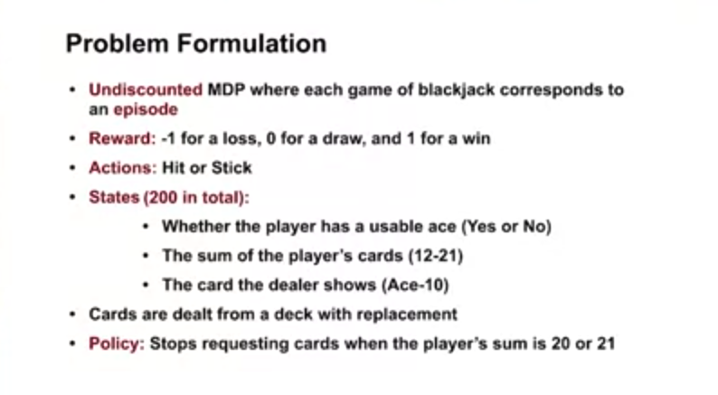

what are some of the implications of Monte Carlo learning? 
- First, Monte Carlo learns directly from experience. So there's no need to keep a large model of the environment. 
- Monte Carlo methods can estimate the value of an individual state independently of the values of any other states. In dynamic programming, the value of each state depends on the values of other states. So this is a pretty big difference. 
- Finally, the computation needed to update the value of each state along the way doesn't depend in any way on the size of the MDP. Rather, it depends on the length of the episode.

## Monte Carlo for Action Values

One way to maintain exploration is called exploring starts. In exploring starts, we must guarantee that episodes start in every state-action pair. Afterwards, the agent simply follows its policy. This is important to know all possible states, so MC can figure out all possible rewards and getting average.

## Monte Carlo control

how can we learn all the action values without exploring starts?

## Monte Carlo Control without Exploring Starts

How can we avoid the unlikely assumption of exploring starts? The only general way to ensure that all actions are selected infinitely often is for the agent to continue to select them. There are two approaches to ensuring this, resulting in what we call on-policy methods and on-policy methods. On-policy methods attempt to evaluate or improve the policy that is used to make decisions, whereas o↵-policy methods evaluate or improve a policy di↵erent from that used to generate the data.

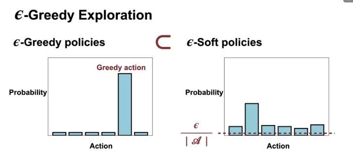

Epsilon soft policies take each action with probability at least Epsilon over the number of actions. For example, both policies shown on the slide are valid Epsilon soft policies. The uniform random policy is another notable Epsilon South policy.

Epsilon soft policies force the agent to continually explore that means we can drop the exploring starts requirement from the Monte Carlo control algorithm an Epsilon soft policy assigns nonzero probability to each action in every state because of this Epsilon soft agents continue to visit all state action pairs indefinitely.

Epsilon soft policies are always stochastic. deterministic policy specify a single action to take in each state stochastic policies instead specify the probability of taking action in each state in epsilon. Soft policies. All actions have a probability of at least Epsilon over the number of actions. They will eventually try all the actions.

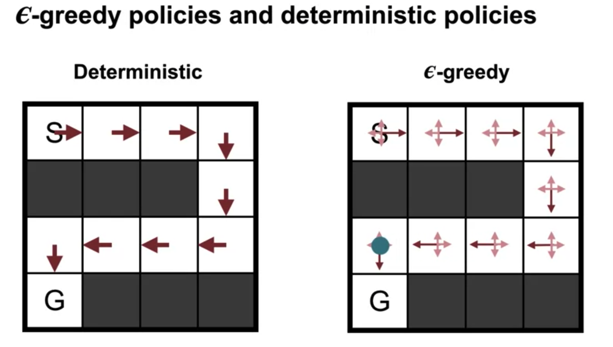

## Off-policy Prediction via Importance Sampling (OJO)

One key rule of off policy learning is that the behavior policy must cover the target policy. In other words, if the target policy says the probability of selecting an action a given State s is greater than zero then the behavior policy must say the probability of selecting that action in that state is greater than 0

It is necessary correct average results in B (behavior) distribution over Pi (target) distribution.

One way to learn about one policy while falling another is to use importance sampling. Importance sampling allows the agent to estimate the expected return under the target policy from experience sampled under the behavior policy.

# Chapter 6. Temporal-Difference Learning

Temporal-difference (TD) learning. TD learning is a combination of Monte Carlo ideas and dynamic programming (DP) ideas. Like Monte Carlo methods, TD methods can learn directly from raw experience without a model of the environment’s dynamics. Like DP, TD methods update estimates based in part on other learned estimates, without waiting for a final outcome (they bootstrap)

TD methods need to wait only until the next time step. At time $t + 1$ they immediately form a target and make a useful update using the observed reward $R_{t+1}$ and the estimate $V (S_{t+1})$.

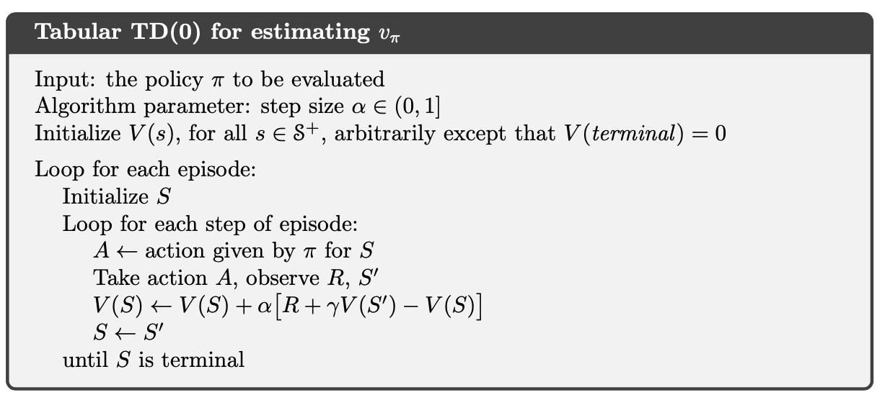

TD updates the value of one state towards its own estimate of the value in the next state. As the estimated value for the next state improves, so does our target.

TD takes the policy to evaluate as input, it also requires a step size parameter and an initial estimate of the value function. Every episode begins in some initial state S, and from there the agent takes actions according to its policy until it reaches the terminal state. On each step of the episode, we update the values with the TD learning rule. We only need to keep track of the previous state to make the update. 

## Advantages of TD:

- Unlike dynamic programming, TD methods do not require a model of the environment. They can learn directly from experience. 
- Unlike Monte Carlo, TD can update the values on every step. Bootstrapping allows us to update the estimates based on other estimates. 
- TD asymptotically converges to the correct predictions. 
- In addition, TD methods usually converge faster than Monte Carlo methods.

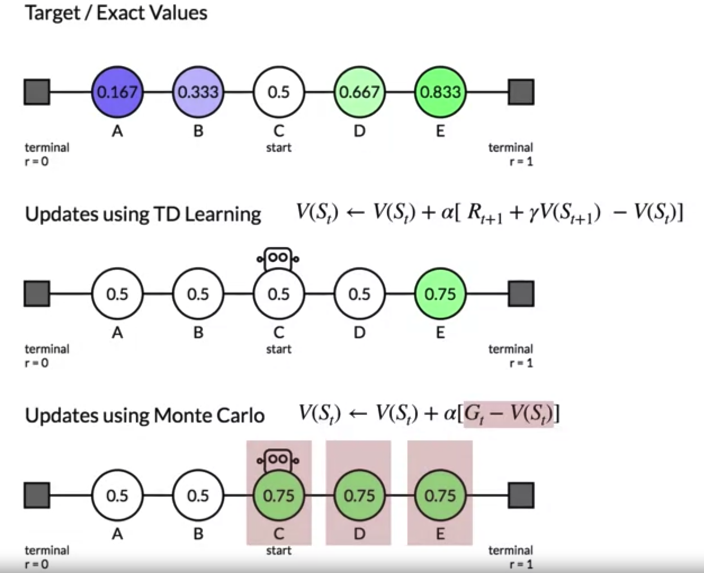

## Sarsa: On-policy TD Control

Instead of looking at transitions from state to state and learn the value of each state, let's look at transitions from state action pair to state action pair and learn the value of each pair. This algorithm is called Sarsa prediction. Sarsa stands for:
State -> Action -> Reward -> State1 -> Action1

the agent needs to know its next state action pair before updating its value estimates. That means it has to commit to its next action before the update. 

Sarsa is the GPI algorithm that uses TD for policy evaluation. 

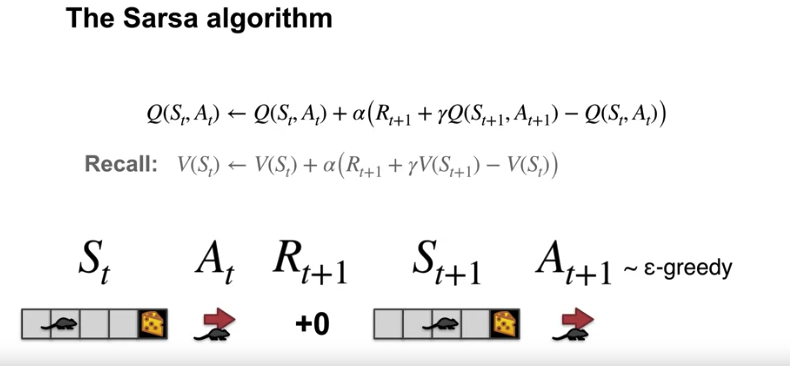

GridWorld example: 
a deterministic policy might get trapped and never learn a good policy in this gridworld. For example, if the policy took the left action in the start state, it would never terminate.
Sarsa avoid this trap, because it would learn such policies or bad during the episode. So it's switch to another policy and not get stuck.

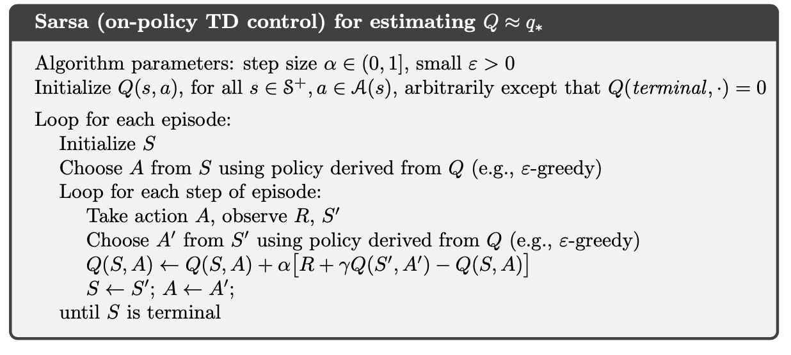

## 6.5 Q-learning: Off-policy TD Control

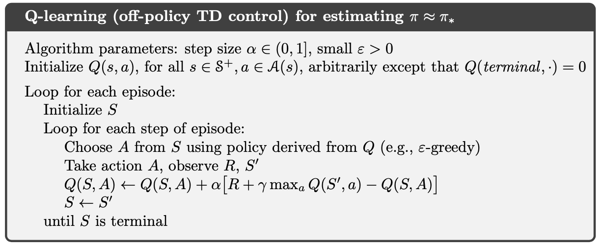

the new element in Q-learning is the action value update.

Since Q-learning learns about the best action it could possibly take rather than the actions it actually takes, it is learning off-policy. 

Q-learning also solves the Bellman equation using samples from the environment. But instead of using the standard Bellman equation, Q-learning uses the Bellman's Optimality Equation for action values. The optimality equations enable Q-learning to directly learn Q-star instead of switching between policy improvement and policy evaluation steps. Even though Sarsa and Q-learning are both based on Bellman equations, they're based on very different Bellman equations. 
- Sarsa is sample-based version of policy iteration which uses Bellman equations for action values, that each depend on a fixed policy.
-  Q-learning is a sample-based version of value iteration which iteratively applies the Bellman optimality equation. Applying the Bellman's Optimality Equation strictly improves the value function, unless it is already optimal. So value iteration continually improves as value function estimate, which eventually converges to the optimal solution. For the same reason, Q-learning also converges to the optimal value function as long as the aging continues to explore and samples all areas of the state action space.

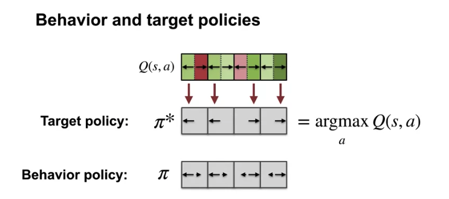

Q-learning's target policy is always greedy with respect to its current values. However, is behavior policy can be anything that continues to visit all state action pairs during learning. One possible policy is epsilon greedy. The difference here between the target and behavior policies confirms that Q-learning is off-policy

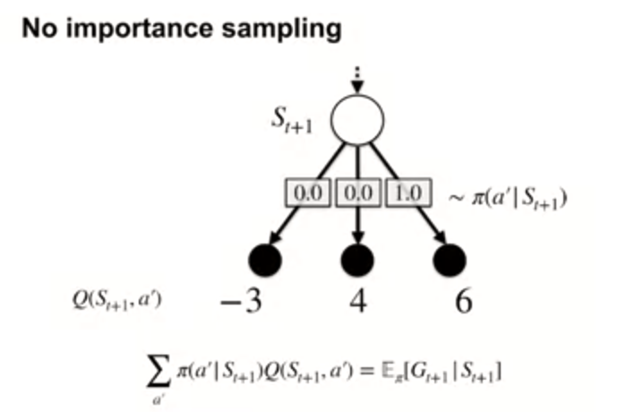
In image below, we can see how Q-learning calculates probabilities taking next state, given an action. How it is take a greedy action, the probabilities are all for 6, and rest 0's.

But sometimes, SARSA's behavior could be better in special cases:

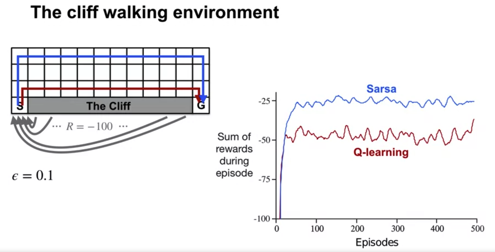

## 6.6 Expected Sarsa

Sarsa estimates this expectation by sampling the next date from the environment and the next action from its policy. But the agent already knows this policy, so why should it have to sample its next action? Instead, it should just compute the expectation directly. In this case, we can take a weighted sum of the values of all possible next actions. The weights are the probability of taking each action under the agents policy. Explicitly computing the expectation over next actions is the main idea behind the expected Sarsa algorithm

The algorithm is nearly identical to Sarsa, except the T error uses the expected estimate of the next action value instead of a sample of the next action value. That means that on every time step, the agent has to average the next state's action values according to how likely they are under the policy.

- expected Sarsa algorithm explicitly computes the expectation under its policy, which is more expensive than sampling but has lower variance.

- expected Sarsa is more robust than Sarsa to large step sizes.

- expected Sarsa and Q-Learning both use the expectation over their target policies in their update targets. This allows them to learn off-policy without importance sampling. Expected Sarsa with the target policy that's greedy with respect to its action values, is exactly Q-learning.

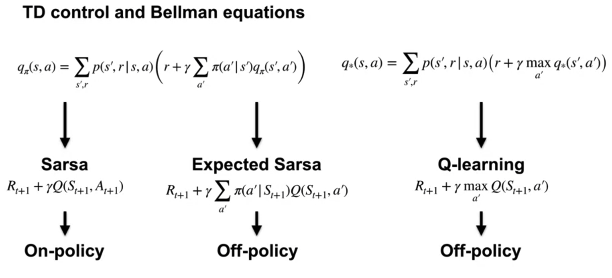

Recall the update equation for Sarsa. Sarsa's update target includes the action value for the next state in action. Now, recall that expected Sarsa instead uses the expectation over its target policy. To compute the expectation, we simply sum over the action values weighted by their probability under the target policy. 

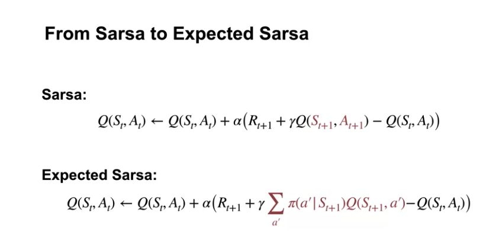

## Chapter 8. Planning and Learning with Tabular Methods

- Model-based methods rely on planning.
- model-free methods primarily rely on learning.

In particular, the heart of both kinds of methods is the computation of value functions.

**Model**

By a model of the environment we mean anything that an agent can use to predict how the environment will respond to its actions. Given a state and an action, a model produces a prediction of the resultant next state and next reward.

- stochastic model, if the model is stochastic, then there are several possible next states and next rewards, each with some probability of occurring. 
- Distribution models, where some models produce a description of all possibilities and their probabilities. Distribution models can be used to compute the exact expected outcome by summing over all outcomes weighted by their probabilities.
- Sample models, where models produce just one of the possibilities, sampled according to the probabilities. For example, consider modeling the sum of a dozen dice. A distribution model would produce all possible sums and their probabilities of occurring, whereas a sample model would produce an individual sum drawn according to this probability distribution. Sample models require less memory.

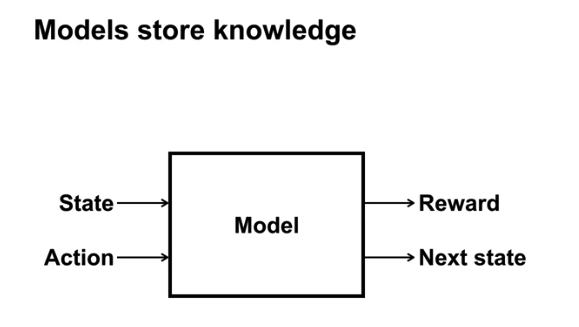

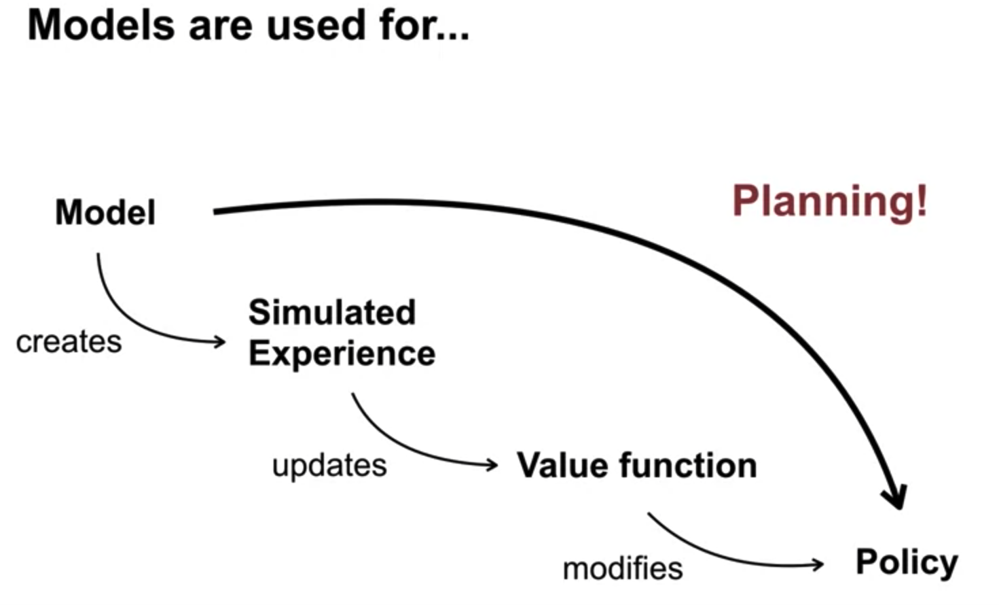

- Planning is a process which takes a model as input and produces unimproved policy.

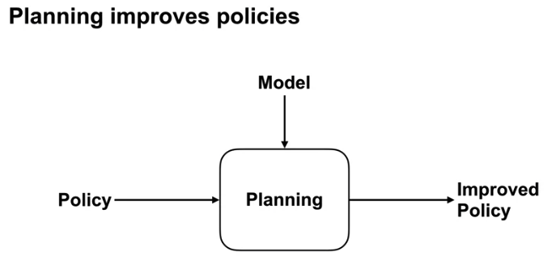

One possible approach to planning is to first sample experience from the model. This is like imagining possible scenarios in the world based on your understanding of how the world works. This generated experience can then be use to perform updates to the value function as if these interactions actually occurred in the world. Behaving greedily with respect to these improved values results in improved policy. 

- Q-planning, where we use experience from the model and perform a similar update as Q-Learning to improve a policy.

## 8.2 Dyna: integrated planning, acting and learning

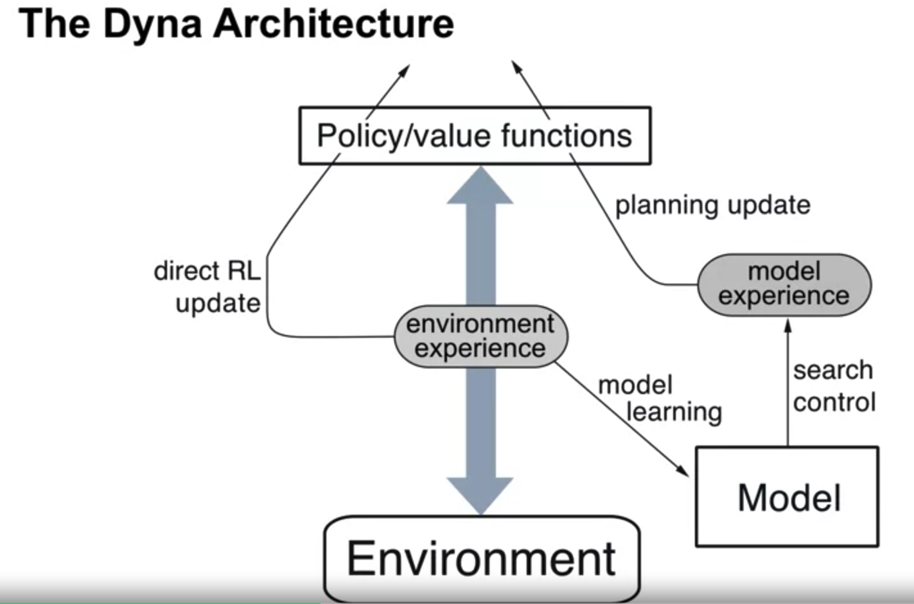

- Dyna-Q, a simple architecture integrating the major functions needed in an online planning agent.

**Tabular Dyna Q** assumes deterministic transitions. Dyna-Q performs several steps of planning. Each planning step consists of three steps; 
- search control, selects a previously visited state action pair at random.
- model query, and 
- value update.

Dyna-Q performs many planning updates for each environment transition. 

## 8.3 When the model is Wrong

Models are inaccurate when transitions they store are different from transitions that happen in the environment. At the beginning of learning, the agent hasn't tried most of the actions in almost all of the states. The transitions associated with trying those actions in those states are simply missing from the model. We call models of missing transitions incomplete models. 

The model could also be an accurate if the environment changes. Taking an action in a state could result in a different next state and reward than what the agent observed before the change. 

**Dyna-Q+**
To encourage the agent to revisit its state periodically, we can add a bonus to the reward used in planning. This bonus is simply Kappa, times the square root of Tau, where r, is the reward from the model and Tau is the amount of time it's been since the state action pair was last visited in the environment. Tau is not updated in the planning loop, that would not be a real visit. Kappa is a small constant that controls the influence of the bonus on the planning update. If Kappa was zero, we would ignore the bonus completely. Adding this exploration bonus to the planning updates results in the Dyna-Q+ algorithm.

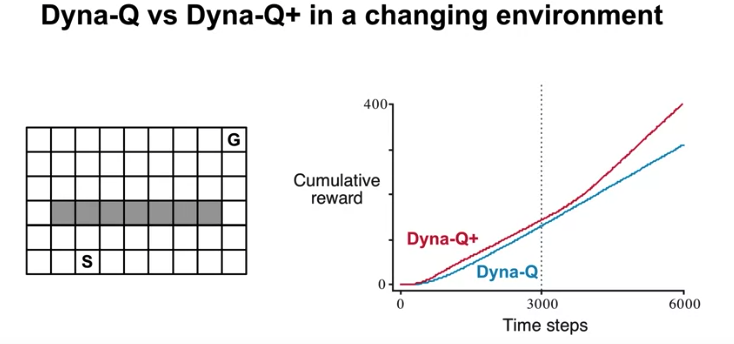

# Part II: Approximate Solution Methods

So far, we can represent almost all (!not all) RL algorithms with next tree. 

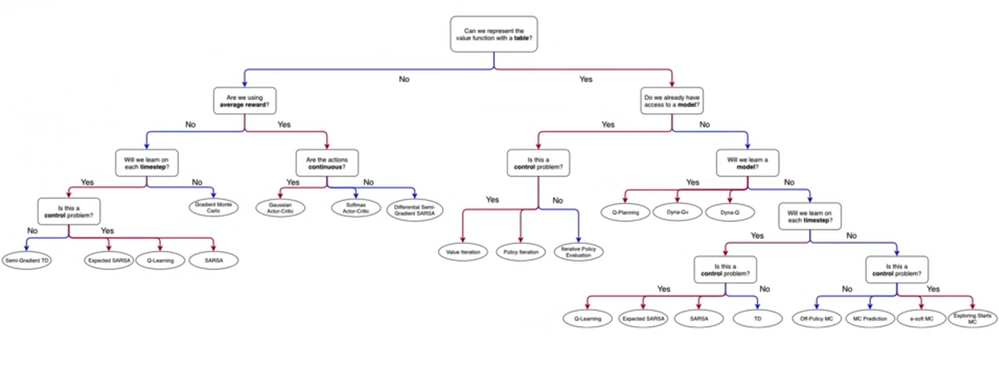

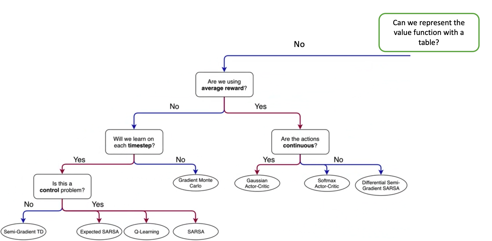

In the second part of the book we extend the tabular methods presented in the first part to apply to problems with arbitrarily large state spaces.

# Chapter 9 On-policy Prediction with Approximation

**Course 3 -> Week1 -> Video Moving to parameterized functions** where explains tha basics of function approx.

The novelty in this chapter is that the approximate value function is represented not as a table but as a parameterized functional form with weight vector w.

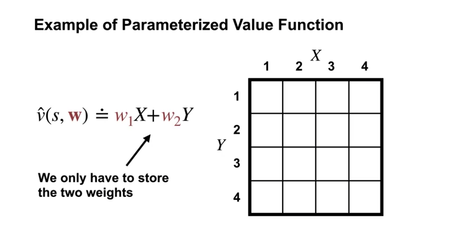

Our choice of feature impacts the kinds of value functions we can represent.

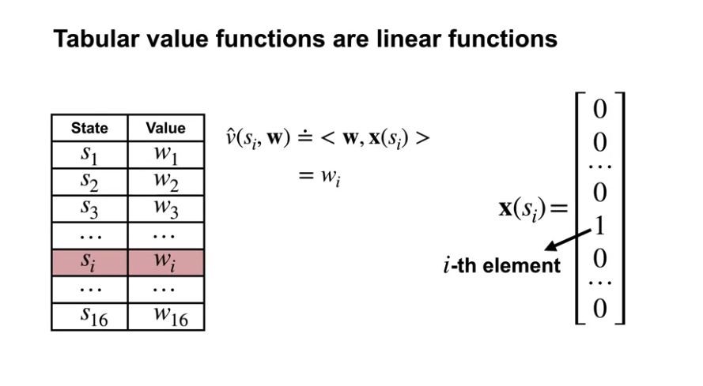

Since every state's value is represented by a separate weight, this is equivalent to a tabular value function. These parameterized values are general, and we can consider lots of different types of functions. Neural networks are an example of a non-linear function of state. The output of the network is our approximate value for a given state. The state is passed to the network as the input. All the connections in the network correspond to real valued weights. When data is passed through a connection, the weight is multiplied by its input. This process transforms the input state through a sequence of layers to finally produce the value estimate. 

**Generalization** intuitively means applying knowledge about specific situations to draw conclusions about a wider variety of situations. When we talk about generalization in the context of policy evaluation, we mean that updates to the value estimate of one state influence the value of other states.

**discrimination** means the ability to make the values for two states different to distinguish between the values for these two states

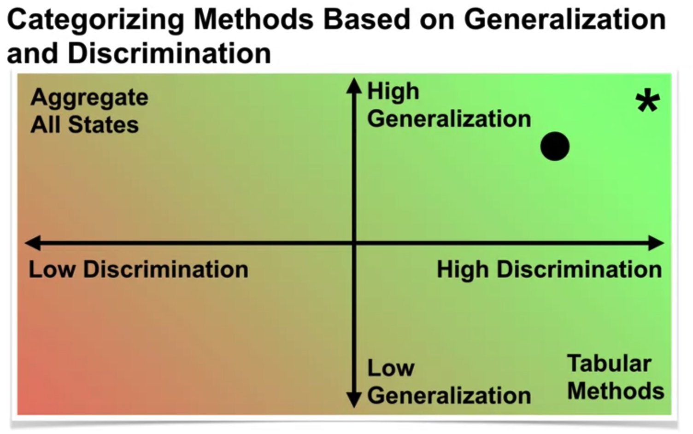

**Framing value estimation as Supervised Learning**

In reinforcement learning, an agent interacts with an environment and continually generates new data. This is often called the online setting. To distinguish it from the offline setting where the full dataset is available from the start and remains fixed throughout learning. If we want to use a function approximation technique, we should make sure it can work in the online setting. Some methods are not compatible with the online setting because they are either designed for a fixed batch of data or there are not designed for temporally correlated data, and the data in reinforcement learning is always correlated. 

TD methods introduce an additional complication when applying techniques from supervised learning. TD methods use bootstrapping, meaning that our targets now depend on our own estimates. These estimates change as learning progresses and so our targets continually change. This is different than supervised learning where we have access to a ground truth label as the target. For example, the price of a house does not depend on our estimate nor does it change when we change our estimates. 

**Mean Squared Value Error objective for policy evaluation (MSVE)**

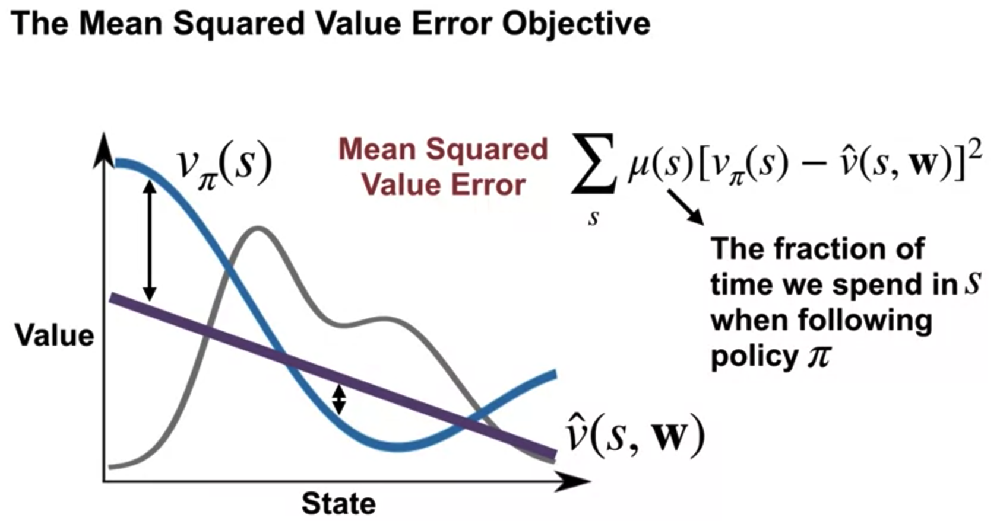

Mu of S should tell us how much we care about each state. A natural measure is the fraction of time each state is visited under the policy. That means we want to minimize the average value error for the states we visit while following Pi. The states that the policy spends more time in have a higher weight in the objective. We care less about errors in the states the policy visits less frequently. Mu of S is a probability distribution as shown on the slide. In this example, the policy spends little time at the extremes of the state space. This means, under the Mean Squared Value Error, we allow the value approximation to have higher error in those states.

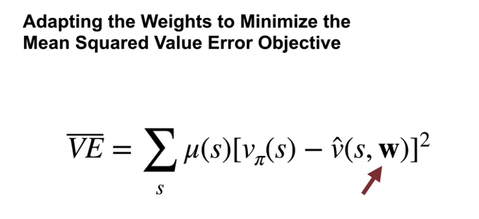

We want to minimize the mean squared value error, to make our value estimates close to the true value function. Recall that our value estimate is given by a function of the state, parameterised by a set of real-valued weights, W. These ways determine how the value's computed for each state, changing the weights will modify the value estimate for many states. 

**Gradient Descent**

We want to minimize the mean squared value error, to make our value estimates close to the true value function. Recall that our value estimate is given by a function of the state, parameterised by a set of real-valued weights, W. These ways determine how the value's computed for each state, changing the weights will modify the value estimate for many states. We have to think about how to change the weights to minimize the overall value error. 

The gradient is a vector of partial derivatives, indicating how a local change in each component of W affects the function. Notice that the gradient has to be the same size as the weight vector. 

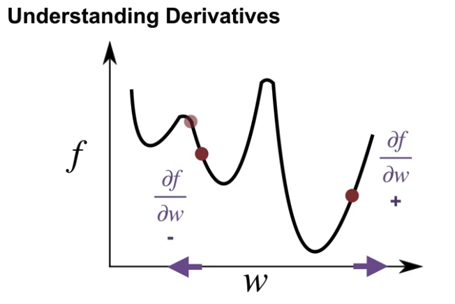

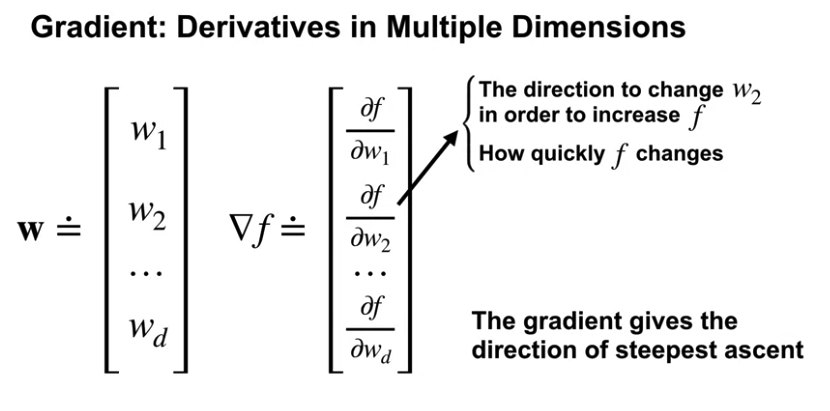

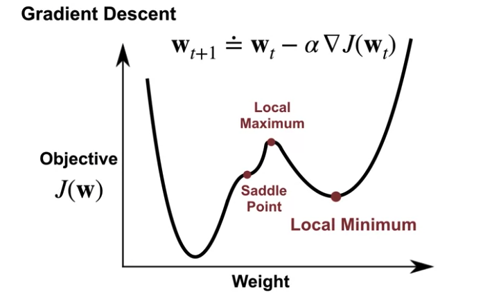

You now know 

- one strategy to minimize objectives, **gradient descent**, and 
- we formulated a clear objective for policy evaluation, **the value error**. 

With Gradient Descent minimize W -> and find Value Error -> find policy evaluation

**stochastic gradient descent**, because it only uses a stochastic estimate of the gradient. In fact, the expectation of each stochastic gradient equals the gradient of the objective. You can think of this stochastic gradient as a noisy approximation to the gradient that is much cheaper to compute, but can nonetheless make steady progress to a minimum. Stochastic gradient descent allowed us to efficiently update the weights on every step by sampling the gradient. 

**State Aggregation with Monte Carlo**

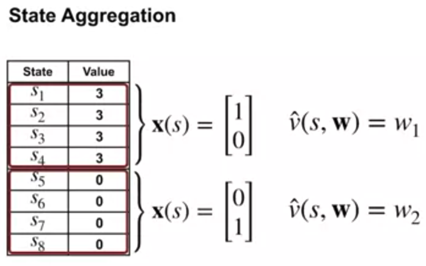

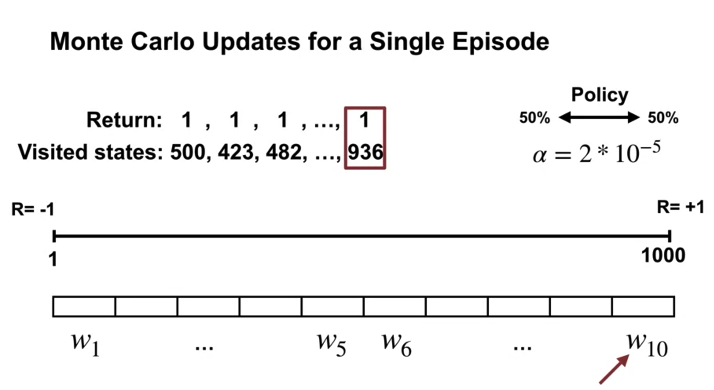

**Semi-Gradient TD for Policy Evaluation**

Recall the gradient Monte Carlo update equation. It updates our current value estimate to be closer to a sample of the return Gt, but we can consider using other targets instead of the return. In fact, we can replace the return in this update with any estimate of the value.

**Comparing TD and Monte Carlo with State Aggregation**

TD often learns faster the Monte Carlo. This is because TD can learn during the episode and has lower variance updates. Monte Carlo is better on long-run performance, it's not always the main concern. We can never run our experiments to achieve asymptotic performance.

**The linear TD update**

**Parameterized value function** as a mapping from states to real numbers. The output is controlled by a vector of real valued weights W. 

## Coarse coding

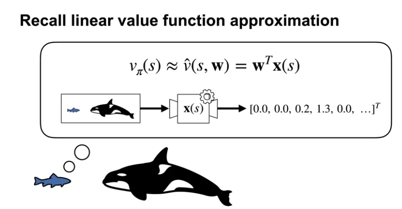

Recall that a tabular representation can be expressed as a binary feature vector. Each state is associated with a different feature. If the agent is in a state then the feature corresponding to that state is 1.

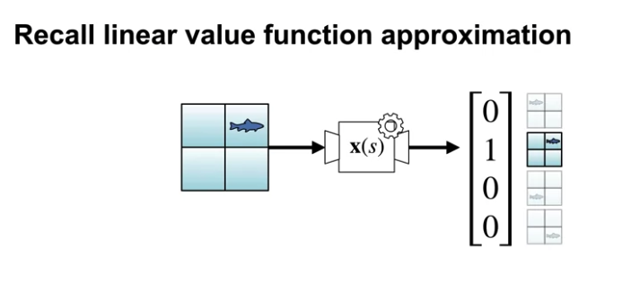

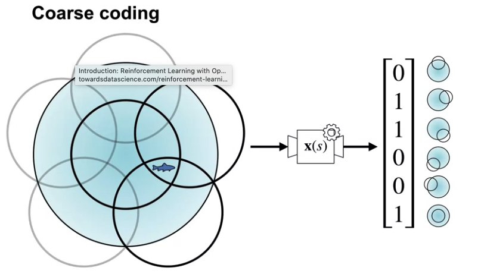
how changing the properties of coarse coding affects generalization and discrimination.

## Tile coding

Tile coding is a specific type of Course Coding. Tile coding performs an exhaustive partition of the state space using overlapping grids. 

tile coding can be used to approximate value functions and policy valuation and we compare tile coding to state aggregation 

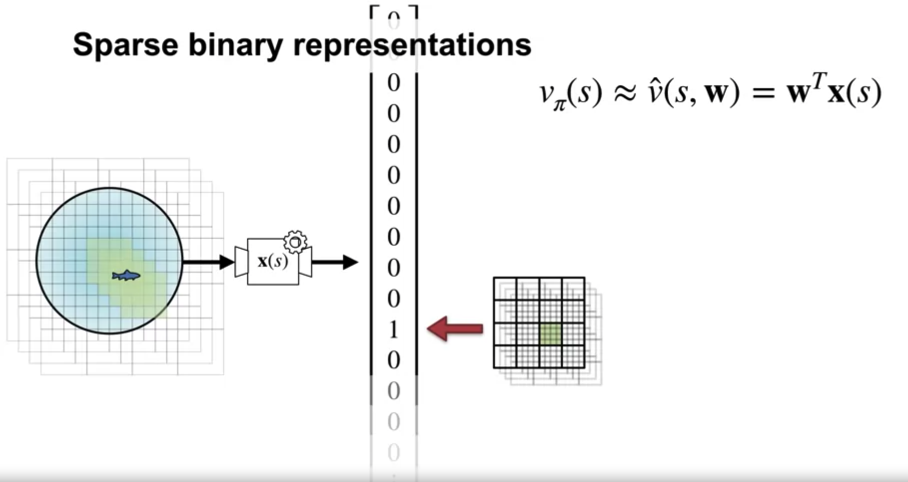

The number of active tiles is always significantly less than the number of total tiles. We can use this to calculate the value function efficiently. Recall that with linear function approximation, the value function is a dot product between a weight vector and a feature vector.

If we were to multiply the two vectors element-wise, many of the element-wise products will be zero. This means we only have to consider the weights at the non-zero elements of the feature vector because the features are binary, the weights at the non-zero features are multiplied by one. Computing the dot product in the usual way would be expensive. Instead, we can just sum the weights corresponding to the active features. Note that this takes a certain amount of time because the number of active features is the same in every state. The feature vectors produced by tile coding may query in the value function cheap computationally.
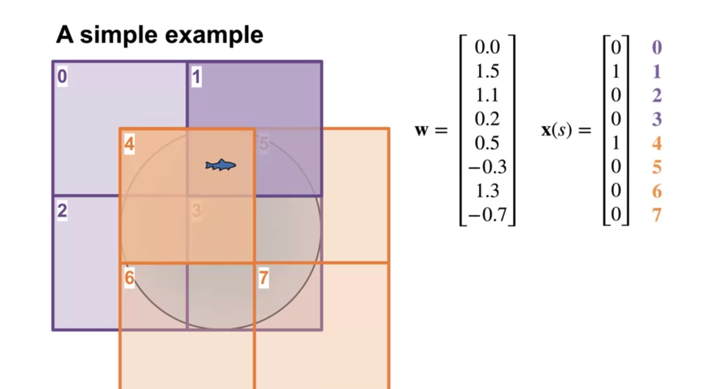

## Neural Networks and how they construct features vectors

When we first build the neural network, we need to specify the initial weights. The way we initialize the weights is important. we can start with a random distribution.

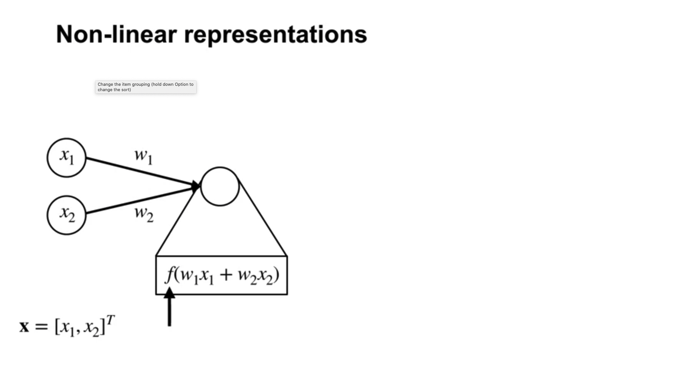
Each output layer gives the output, the approximate value of the current state, the feature.
Those features are non-linear in the input space.

Neural networks can be viewed as a way to construct features, and that neural networks are non-linear functions of s State.

A feed-forward neural network uses a series of layers to produce a representation.

## Summary of this important chapter

A representation is an agent's internal encoding of the state, the agent constructs features to summarize the current input. 

Whenever we are talking about features and representation learning, we are in the land of function approximation. 

# Chapter 10. On-policy Control with Approximation

Recall the **value function** approximation has two components, a weight vector and a feature vector: 

$V_{\pi} \approx v^\hat(s,W) = W^TX(S)$

In a given state, the value estimate is the dot product between these two components.

To move from TD to Sarsa, we need **action value functions**. So the feature representation has to represent actions as well.

Course 3 -> week 3 -> Video Episodic SARSA with Function approx. Here explain how NN works

## Expected SARSA && Q-Learning with Function approximation

Recall the update equation for Sarsa. Sarsa's update target includes the action value for the next state in action. Now, recall that expected Sarsa instead uses the expectation over its target policy. To compute the expectation, we simply sum over the action values weighted by their probability under the target policy. 

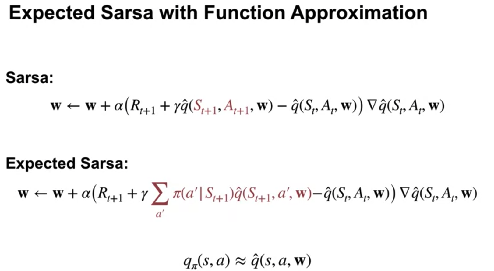

The same expectation can be computed even when we use function approximation. Let's see how to do this. First, recall the update for Sarsa with function approximation. It looks similar to the tabular setting except the action value estimates are parameterized by the weight factor, W. We also have a gradient term to distribute the error to the weights appropriately. Expected Sarsa with function approximation follows a similar structure. We compute the action values from our weight vector for every action in the next state. Then we compute this expectation under the target policy.

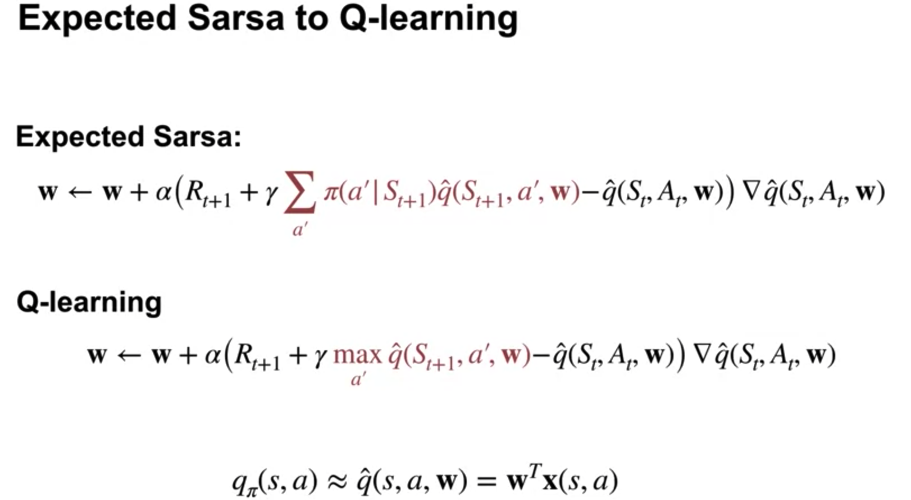

Fortunately, Q-learning is a special case of expected Sarsa. In Q-learning, the target policy is greedy with respect to the approximate action values. Computing the expectation under greedy policy is the same as computing the maximum action value. So the Q-learning update with function approximation is actually quite straightforward. We just use the max in place of the expectation.

## Optimistical initial values in function approximation

In function approximation, optimistic initial values corresponds to initializing the weights such that the resulting values are optimistic. In some cases this is straightforward, for example, when the features are binary, we simply initialize each weight to be the largest possible return. Then, as long as each state has at least one feature active, the value will be optimistic and likely overly so.

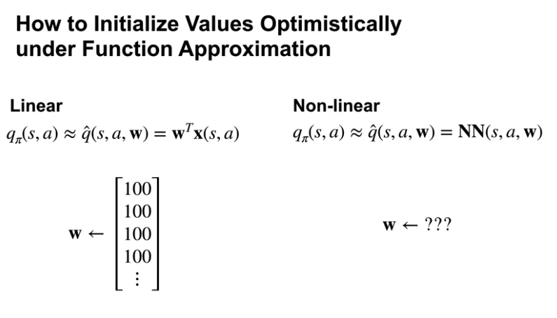

## Average reward.

Instead of maximizing the discounted return from the current state, we can think about maximizing the average reward that a policy receives overtime. We defined differential returns and differential values, these enable the agent to assess the relative value of actions in the average reward setting. 

## Differential Semi gradient SARS

approximates differential values to learn policies. 

# Chapter 13. Policy Gradient Methods

From this moment, we are going to study a new class of methods where the policies are parameterized directly.

Previously, we used epsilon-greedy to convert approximate action values into a policy. But we can also consider policy which maps states directly to actions without first computing action values.

Suppose the mountain cart watched before:

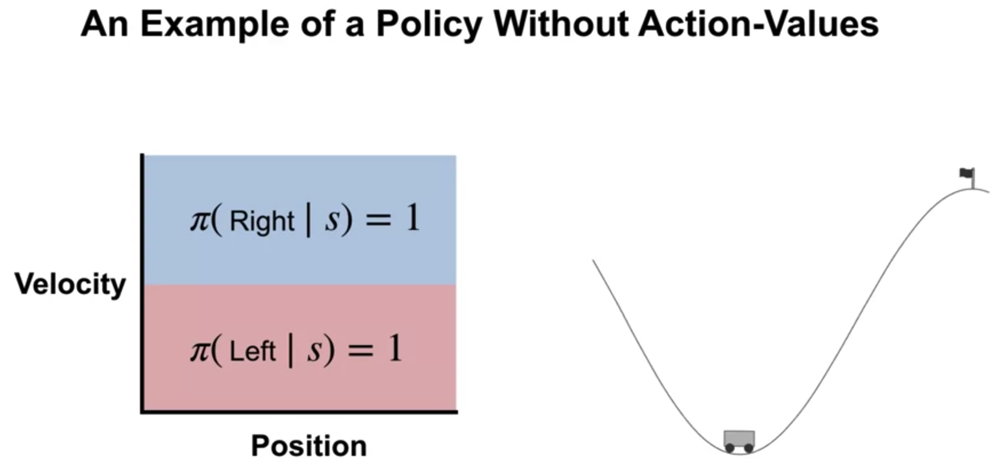

Ee can define such a policy. Simply choose accelerate right when the velocity is positive and otherwise, choose the accelerate left action. Put another way, this policy accelerates in whatever direction we are already moving. In fact, this simple energy pumping policy, is close to optimal. This policy does not make use of action values at all. 

The parameterized function, has to generate a valid policy. This means, it has to generate a valid probability distribution over actions for every state. Specifically, the probabilities selecting an action, must be greater than or equal to zero. For each state, the sum of the probabilities over all actions must be one. It requires some thought to satisfy these conditions for a parameterized function. For example, this means we can not use a linear function directly like we did with value function approximation.

It's important to distinguish between **action preferences** and **action values**. Preferences indicate how much the agent prefers each action but they are not summaries of future reward. Only the relative differences between preferences are important. For example, we could add plus 100 to all the preferences and it would not matter. An epsilon-greedy policy derived from action values can behave very differently than a softmax policy over action preferences. In epsilon-greedy, the action corresponding to the highest valued action, is selected with high probability. The probability selecting all the other actions, is quite small. Actions with nearly the same but lower action value, are selected with much lower probability. On the other hand, actions with very poor action values, are still selected frequently due to the epsilon exploration step. 

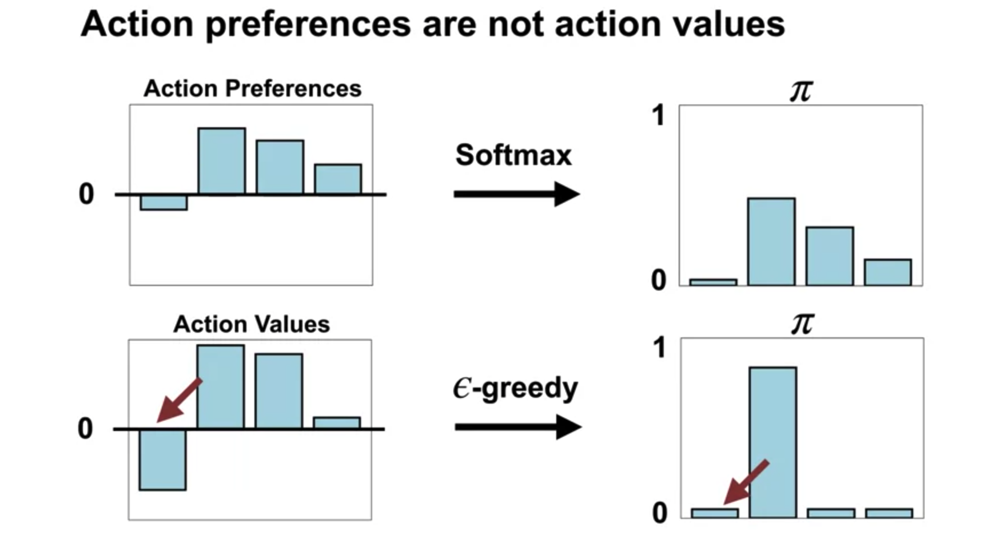

Learning policies directly gives us more flexibility in how we solve our problems.

## parameterized stochastic policies

The policy can start off stochastic to guarantee expiration. Then as learning progresses, the policy can naturally converge towards a deterministic greedy policy. A softmax policy can adequately approximate a deterministic policy by making one action preference very large.

These parameterized stochastic policies are useful because 
- they can autonomously decrease exploration over time. 
- They can avoid failures due to deterministic policies with limited function approximation. 
- And sometimes the policy is less complicated than the value function. 

## the objective for Learning Policies

the basic idea will be to specify an objective, and then figure out how to estimate the gradient of that objective from an agent's experience. 

the ultimate goal of reinforcement learning is to learn a policy that obtains as much reward as possible in the long run. It turns out that when we parameterize our policy directly, we can also use this goal directly as the learning objective. 

**Summary of 3 goals as an objective**

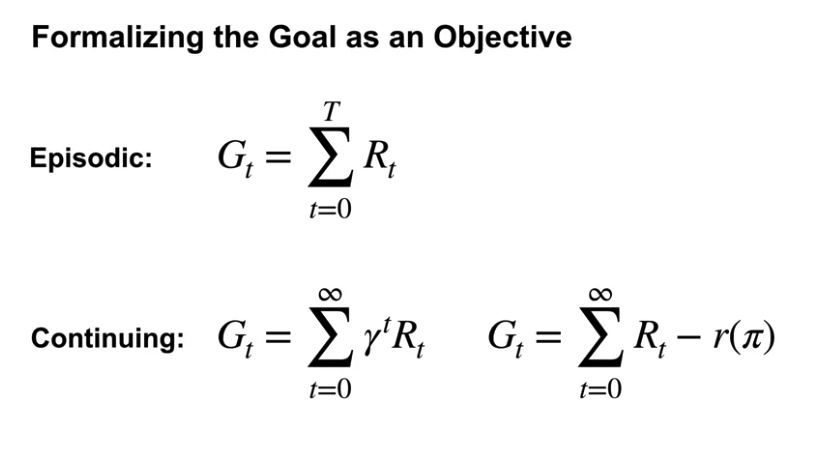

Remember what our aim is here, to find a way to **directly optimize the parameters of a policy**. The first step is to write the average reward objective in a form that we can optimize.

Now, our aim is to learn a policy that directly optimizes average reward.

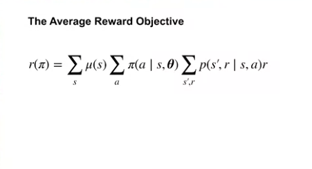

Let's break this formula down starting from the inner sum and moving out. This inner sum gives the expected reward if we start in state S and take action A. This is simply the sum over all rewards we might receive weighted by their probability from S and A. We sum over next states S prime to get marginal probabilities over the reward. The next level of the summation is over all possible actions weighted by their probability under Pi. This gives us the expected reward under the policy Pi from a particular state S. Finally, we get the overall average reward by considering the fraction of time we spend in state S under policy Pi. The distribution Mu provides these probabilities. The expected reward across states is a sum over S of the expected reward in a state weighted by Mu of S, r Pi is our average reward learning objective.

Our goal of policy optimization will be to find a policy which maximizes the average reward. Our basic approach will be to estimate the gradient of the objective with respect to the policy parameters and adjust the parameters based on this estimate.

Up until now, we've used a very different approach. We use the Generalized Policy Iteration framework to learn approximate action values. Then we use these approximate values indirectly to infer a good policy. Now, we're interested in **learning policies directly**. 

**we can use the average reward as an objective for policy optimization.** 

## The policy Gradient Theorem

It allows us to write the gradient of the **average reward** so that it is easier to estimate from experience. 

## Estimating the Policy Gradient

We have an objective for policy optimization. We also have the policy gradient theorem, which gives us a simple expression for the gradient of that objective. We'll complete the puzzle by showing how to estimate this gradient using the experience of an agent interacting with the environment.

We want to derive a gradient descent algorithm for our policy. We simply make updates from states we observe while following policy pi.

## Actor-critic algorithm (for continuing tasks)

the parameterized policy plays the role of an actor, while the value function plays the role of a critic, evaluating the actions selected by the actor.

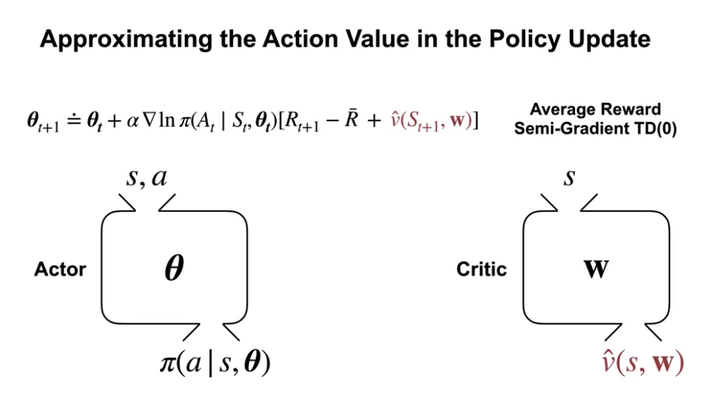

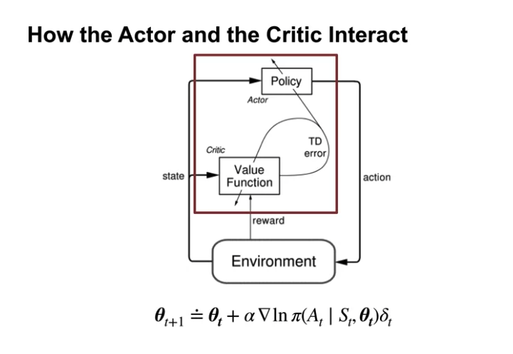

Subtracting this baseline tends to reduce the variance of the update which results in faster learning. This update makes sense intuitively. After we execute an action, we use the TD error to decide how good the action was compared to the average for that state. If the TD error is positive, then it means the selected action resulted in a higher value than expected. Taking that action more often should improve our policy. That is exactly what this update does. It changes the policy parameters to increase the probability of actions that were better than expected according to the critic. Correspondingly, if the critic is disappointed and the TD error is negative, then the probability of the action is decreased. The actor and the critic learn at the same time, constantly interacting. The actor is continually changing the policy to exceed the critics expectation, and the critic is constantly updating its value function to evaluate the actors changing policy. With the policy update in place, we're ready to go through the full algorithm for average reward actor-critic. To start, we specify the policy parameterization and the value function parameterization. 

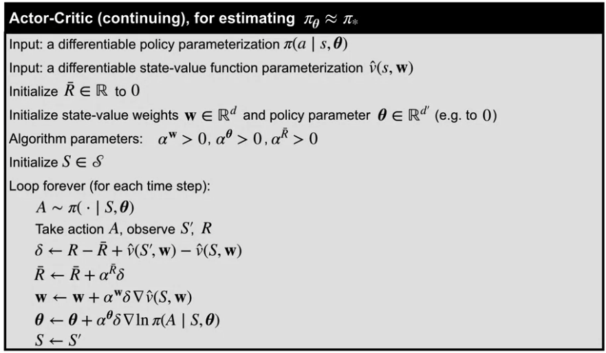

## Actor-Critic with Softmax Policies

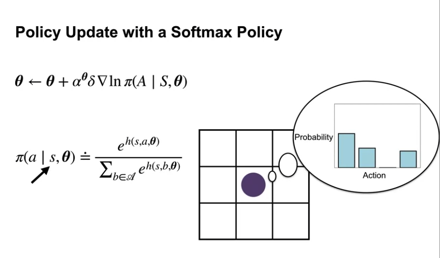

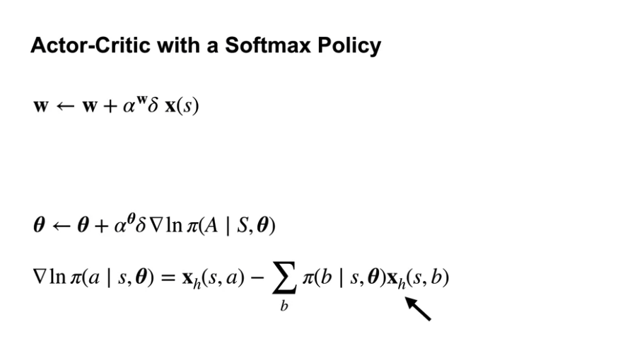

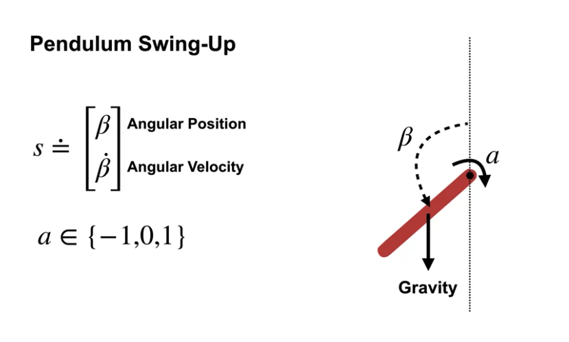
The pendulum can move freely subject only to gravity and the actions applied by the agent. The state of the pendulum is the angle of the pole, and the angular velocity, both are real valued quantities. Our simulation has just three discrete actions, apply a constant angular acceleration clockwise, counterclockwise, or apply no angular acceleration. We use a softmax policy for this task because the action space is discrete. 

A good policy must apply actions that move the pendulum away from the desired position in order to gain enough momentum to swing up.
And must continually balance the pole in the vertical position.

First of all, we have to design our **function approximator** and our **policy parameterization**.

## Gaussian policies for continuous Actions

One of the nice things about **policy-based methods**, is that they give us a natural way to deal with very large or even continuous action spaces. We don't have to use a policy parameterization that assigns individual probabilities to each action. We could instead learn the parameters of some distribution over actions. 

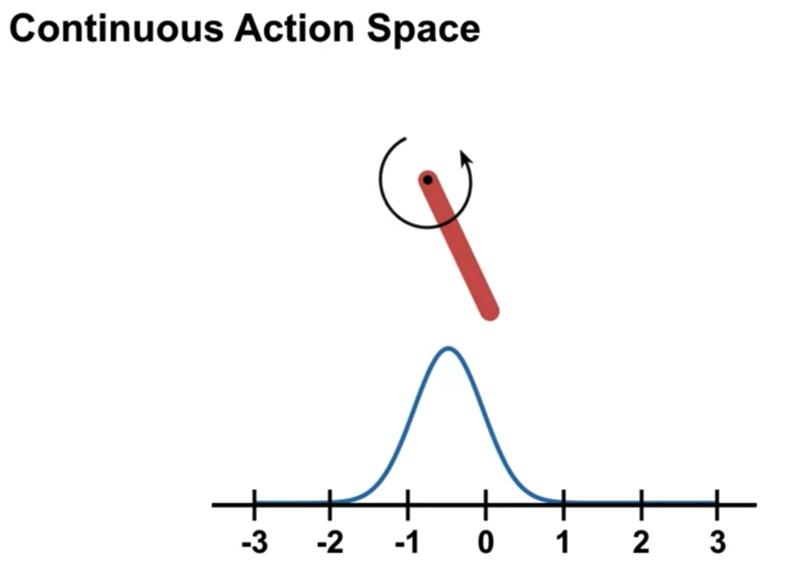
another strategy is to parameterize the policy as a continuous distribution, such as a Gaussian distribution.

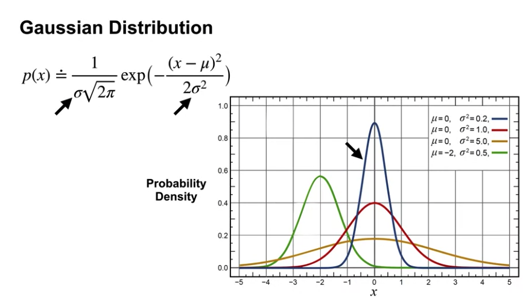

We make the parameters Mu and Sigma functions of the state. This way, the agent can assign different action distributions to different states. Mu can be any parameterized function.

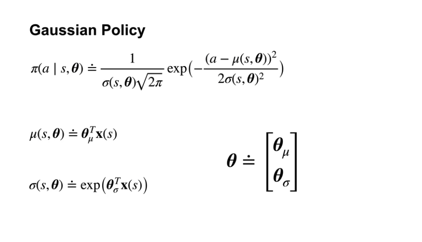
Let's define our policy using a Gaussian over actions. We make the parameters Mu and Sigma functions of the state. This way, the agent can assign different action distributions to different states. Mu can be any parameterized function. But to keep things simple, let's make it a linear function of the state features. The policy parameters associated with Mu are denoted by Theta Mu. The parameter's function Sigma has one constraint. It must be positive. To enforce this, we will parameterize it as the exponential of a linear function. The policy parameters associated with Sigma are denoted by Theta Sigma. Our policy parameters now consists of these two stack parameter vectors of equal size. We've defined our Gaussian policy.

**the main point of a policy is that it gives us a way to select actions. To select actions with this policy, we sample from the Gaussian**

Sigma essentially controls the degree of exploration. We typically initialize the variance to be large so that a wide range of actions are tried. As learning progresses, we expect the variance to shrink and the policy to concentrate around the best action in each state. Like many parameterized policies, the agent can reduce the amount of exploration over time through learning.

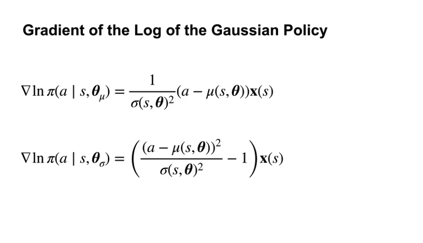

## Experience Replay (Course 4 -> In-depth on Experienced Replay)

To get some intuition for experience replay, let's first remember Dyna-Q. The idea is to learn a model using sample experience. Then simulated experience can be obtained from this model to update the values. This procedure of using simulated experience to improve the value estimates is called planning.

The idea is to learn a model using sample experience. Then simulated experience can be obtained from this model to update the values. This procedure of using simulated experience to improve the value estimates is called planning.

Experience replay is a simple method that can get some of the advantages of Dyna by saving a buffer of experience and using the data stored in the buffer as a model. This view of prior data as a model works because the data represents actual transitions from the underlying MDP. Furthermore, as a side note, this kind of model that is not learned and simply a collection of experience can be called non-parametric as it can be ever-growing as opposed to a parametric model where the transitions are learned to be represented with a fixed set of parameters or weights.

The agent can perform several of these planning updates, which are the replay updates per each real step in the environment. More updates means we extract more from the data we have observed. Each of these replay updates consists of a mini batch update to reduce the noise of that update.