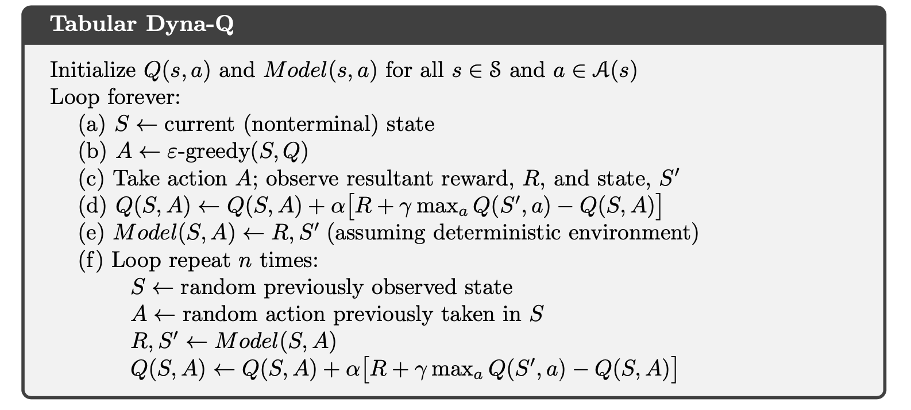
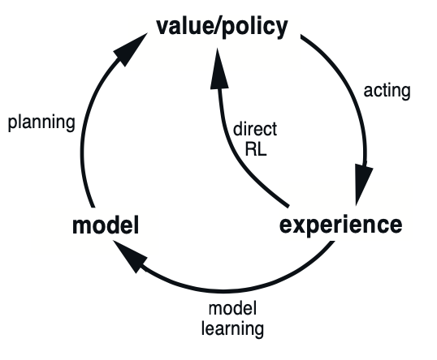
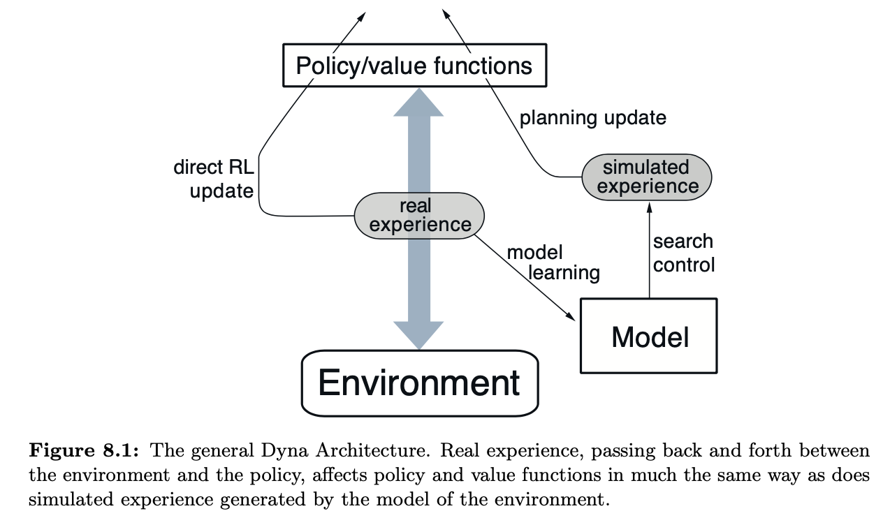
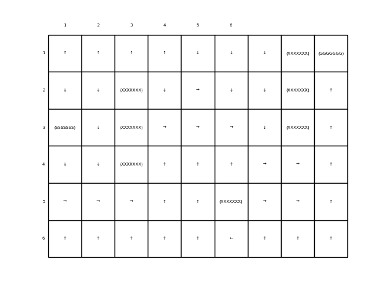
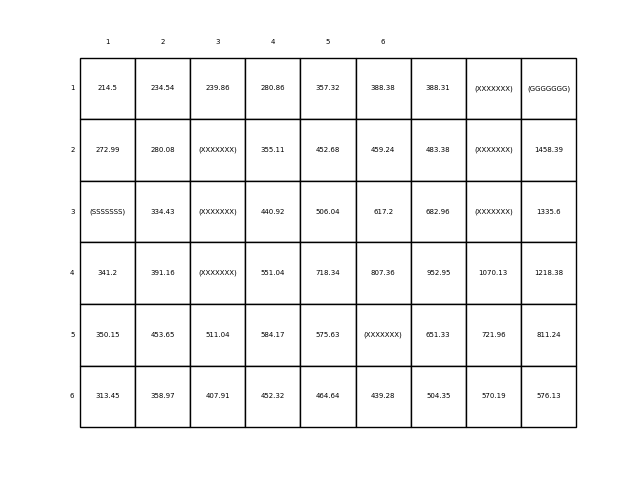
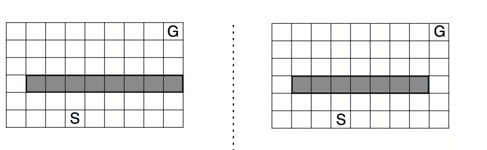
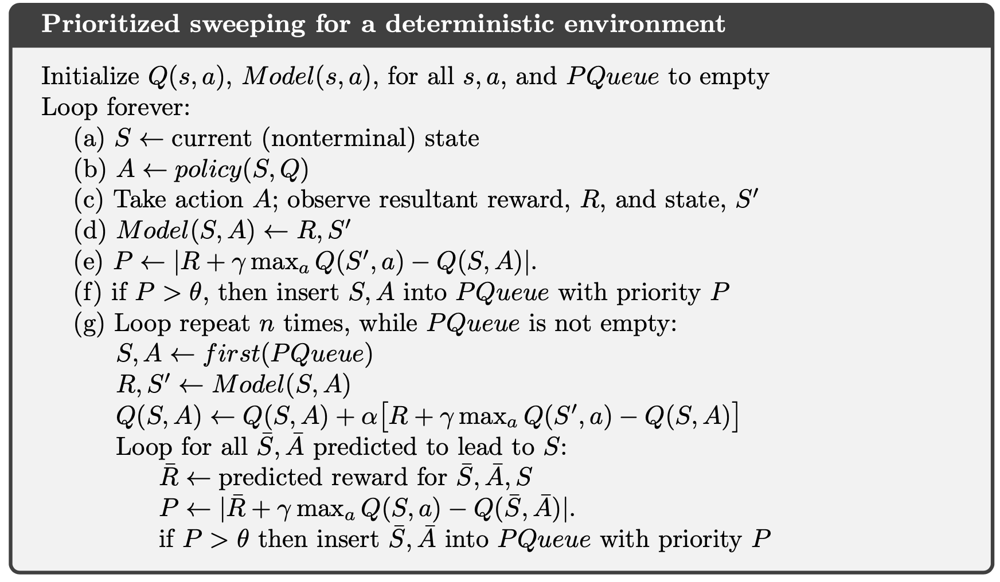
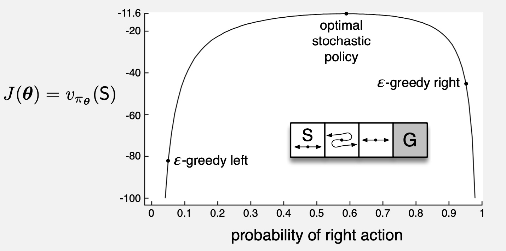
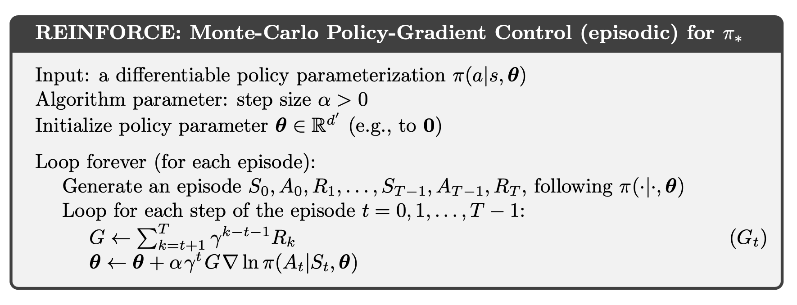

### Sources 

### Table of contents

## GridWorld
  - [Tabular Dyna-Q](#TABULAR-DYNA-Q)
  - [Dyna-Q +](#Dyna-Q-+)
  - [Prioritized Sweeping](#Prioritized-Sweeping)
## Short Corridor
  - [Policy Approximation](#Policy-approximation)
  - [REINFORCE Monte Carlo Policy Gradient](#REINFORCE-MC)
---

First implementation of a RL algoritmhs. It is a typical and beginner example for understanding basics ideas and concepts of RL.

We are going to follow the TextBook [Sutton]

The GridWorld and Maze are explained in chapter 8, and they are good examples of discrete and stochastic environments.

## Tabular Dyna-Q

The algorithm is

Model and Planning verion that it is called Tabular Dyna-Q. 

If we take only until (d) step, it is called a **direct RL** or **Q-learning** algorithm. And steps (e) and (f) it is the Tabular Dyna-Q with Model and Planning version, which represents next figure

https://youtu.be/K3DimDK5H6A

- Tabular_Dyna-Q V2.ipynb and Tabular_Dyna-Q V2.py contains implementation of TABULAR DYNA-Q. 
Running the code, we obtain figures representing policies and values for a given value. They are examples of a given value.

---
## Dyna-Q +

The Dyna-Q+ agent that did solve the shortcut maze uses one such heuristic. This agent keeps track for each state–action pair of how many time steps have elapsed since the pair was last tried in a real interaction with the environment. The more time that has elapsed, the greater (we might presume) the chance that the dynamics of this pair has changed and that the model of it is incorrect. To encourage behavior that tests long-untried actions, a special “bonus reward” is given on simulated experiences involving these actions.

One possible example of a grid changing world is showed in next image

The algorithm is in "DynaQ+ V1.py" and .pynb

---
## Prioritized Sweeping

The algorithm is shown below

The idea behind this algorithm is that we can work only in states that have changed recently and update states closed to him, that is, backward focusing. We have a queu of states and theirs predecessors, so if one state is changed, all its predecessors too. Thus we only update a few states each time.

The algorithm is in "prioritized sweeping V1.py" file

---
## Policy Approximation 

1. Short corridor with switched actions.

Algorithm can find in "short_corridor(chapter_13_policy_approximation).py"

## REINFORCE Monte Carlo Policy Gradient

Generic algorithm can see below

and code in "short_corridor(chapter_13_REINFORCE_MonteCarlo_Policy_Gradient_Control).py"

